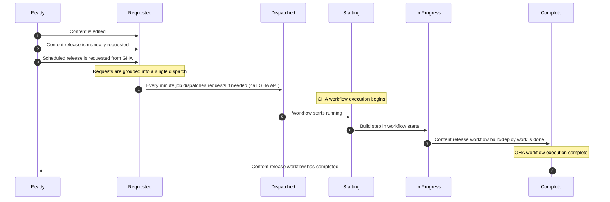

# CMS Content Release

Content release is the process that extracts content from Drupal via an API, builds a static HTML version of the website, and deploys it to an S3 bucket for public consumption.


## Requesting a content release

Content releases can be requested in one of four ways:

* Automatically via a self-managed schedule in the CMS
* Automatically when some types of content are edited
* Manually when an editor requests a content release
* Manually when a member of the devops or release tools team requests a build


### Scheduled

Related code: `Drupal\va_gov_build_trigger\Service\BuildScheduler`

Builds are automatically requested at the top of every hour 8am-5pm Eastern Time, Monday through Friday.


### Content-triggered

Related code: `Drupal\va_gov_build_trigger\EventSubscriber\EntityEventSubscriber`

When a node is edited that needs to be published ASAP, a content release is requested. There are several conditions that need to be met for this process to occur. Rather than duplicate the logic here, please see the `EntityEventSubscriber` class for details.


### Manual request by editor

Related code: `Drupal\va_gov_build_trigger\Form\BrdBuildTriggerForm`

Some editors have the ability to manually request a content release. This happens through the form displayed at https://prod.cms.va.gov/admin/content/deploy. This form varies by environment. The form displayed on that URL is the only one that actually triggers a production content release.


### Manual request by devops/release tools team member

Related workflow: https://github.com/department-of-veterans-affairs/content-build/actions/workflows/request-content-release.yml

Occasionally, a devops or release tools team member will need to request a content release from the CMS. The GHA workflow above is the mechanism used to do that. Note: that workflow is also triggered after the Daily Production Release in the content-build repository so that frontend changes are deployed to production as quickly as possible.


## Build request handling

Every minute, a cron job processes all outstanding build requests. If needed, a build is _dispatched_ via Github Actions. Further build requests are still accepted, but are not dispatched until the CMS has determined that it is appropriate to do so. The logic for determining if a build can be requested/dispatched can be found in `Drupal\va_gov_build_trigger\Service\ReleaseStateManager`. In particular, this is important so that we avoid situations where multiple content releases are running in parallel.


## Error handling

Two known error states exist and are handled:

1. The CMS doesn't receive any status notifications from the GHA workflow. In this case, the state is considered stale after 40 minutes and will be reset so that another release can be kicked off.
2. The CMS is notified by GHA that a release failed. In this case, the release state in the CMS is reset and a new release will be requested as a retry.


## Content release process

```mermaid
sequenceDiagram
    autonumber

    participant Cron
    participant CMS
    participant GHA

    Note over GHA,CMS: Build triggering conditions
    alt scheduled build
        CMS->>+CMS: queue build request
    else release-triggering content is edited
        CMS->>+CMS: queue build request
    else editor requests build
        CMS->>+CMS: queue build request
    else devops requests build
        GHA->>+CMS: queue build request
    end

    loop Every minute
        Cron->>+CMS: Process content release queues
    end

    CMS->>GHA: Dispatch release request
    rect rgb(20,20,20)
    Note right of GHA: Content release workflow
    GHA->>+CMS: Update staus to Starting
    GHA->>+GHA: Set up runner
    GHA->>+GHA: Wait for release ready
    GHA->>+GHA: Install dependencies
    GHA->>+CMS: Update status to In Progress
    GHA->>+GHA: Build
    GHA->>+GHA: Deploy
    GHA->>+CMS: Update status to Complete
    GHA->>+GHA: Collect metrics and emit notifications
    GHA->>+CMS: Update status to Ready
    end
```



## Content release state transitions




# Environment specific details

## BRD Production

The "Release content" page on the BRD production environment invokes the [same Github Action Workflow]https://github.com/department-of-veterans-affairs/content-build/actions/workflows/content-release.yml) as the automatic deploys. Accordingly the content build output should be identical.


### Configuration

The job configuration is stored in Drupal `settings.php`. Here are the settings for [production](https://github.com/department-of-veterans-affairs/va.gov-cms/blob/main/docroot/sites/default/settings/settings.prod.php#L46). Settings for other environments can be found in the `*.settings.php` [files](https://github.com/department-of-veterans-affairs/va.gov-cms/blob/master/docroot/sites/default/settings). The setting keys are:

```php
$settings['va_gov_frontend_build_type'] = 'brd';
$settings['github_actions_deploy_env'] = 'prod';
```

## BRD Staging

Currently, content releases cannot be requested nor dispatched from the staging environment because the Github Actions workflow for content release does not support any environment other than production.


## Tugboat and Local Development Environments

The Tugboat and local development versions of the release content page do not trigger a Github Actions workflow. Instead, they check out the latest version (or a specified branch or release) of the [frontend](https://github.com/department-of-veterans-affairs/content-build/), build it, and then perform a content release to the same environment that it was requested from (local environments will release content to the local environment, Tugboat environments will release content to that same Tugboat environment, etc).

For more information on creating or releasing content from a preview environment, see [Environments](./environments.md).

## Troubleshooting

Sometimes the state gets stuck and needs to be reset.  It can be done with a drush command
`drush va-gov:content-release:reset-state`

## Other resources:

* https://github.com/department-of-veterans-affairs/va.gov-team/tree/master/platform/cms/accelerated_publishing/content-build


[Table of Contents](../README.md)
