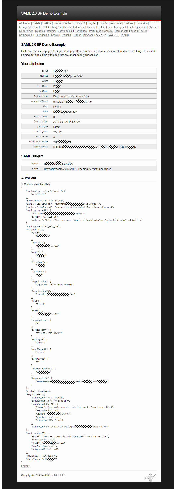

# CMS-login

## The CMS uses A SimpleSAML connection to VA's Active Directory:

Accounts can be created in either of two ways:
1.  Login with PIV card first, have administrator add user role(s) on request. (Recommended)
Have the user go to the CMS login and click the link to login with their PIV card.
The account will be created with no additional permissions.
1. Have an administrator create the user first and assign role.
    1. The username and email address must both match the va.gov email address of the user.

## Technical Details
  * SSOi is handled by the simplesaml_php module.  It connects existing accounts to the Active Directory user via their email address and user name.
  * Once the connection has been established by the the user logging in with their PIV card, the system will update their CMS account with username and email address changes from their Active Directory account.
  * Logging in via username and passwords will be turned off once the SSOi system has proven to be reliable.
  * Config settings are split to allow debugging data on DEV but not STAGING or PROD.
  * Accounts are connect in authmap by VAUID (a number that is specific to a single user.)
  * Email addresses are synced at each login for changes with adUPN (the user's email address) and that email is also used to connect existing accounts to initial logins with SSOi.
  * Usernames are synced at each login to the adUPN (the user's email address).

##Sample SSOi Response

