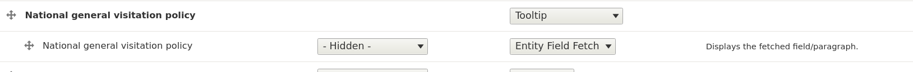

# Content Model: Centralized Content

Centralized content uses the contrib module [Entity Field Fetch](https://www.drupal.org/project/entity_field_fetch) to have a field on one content type, grab content dynamically from a paragraph on a Centralized Content node. As a human enforced standard, Entity Field Fetch fields will be prefixed with `field_cc_` so that they can be recognized as a centralized content field.

When loading a node that use centralized content, it will provide a reference to the paragraph that looks like this

```
[field_cc_bottom_of_page_content] => Array
   (
      [x-default] => Array
         (
               [0] => Array
                  (
                     [target_type] => paragraph
                     [target_uuid] => bdf77955-a825-4931-b9ee-cb0a067cf70d
                     [target_field] =>
                  )

         )

   )
```

The target_type and the target_uuid provide the details about where the content should come from.  The values will be the same for ALL nodes that use the `field_cc_bottom_of_page_content` which in this case appears on all VAMC System Policies Pages.

## Current Implementations
- VAMC System Policies Page pulls centralized content from [VAMC System Policies Page Content](https://prod.cms.va.gov/centralized-content/vamc-system-policies-page-content)
   - field_cc_bottom_of_page_content
   - field_cc_gen_visitation_policy
   - field_cc_intro_text
   - field_cc_top_of_page_content

## How to establish a new Centralized Content field?
1. Create a new appropriately named centralized content node on [Prod](https://prod.cms.va.gov/node/add/centralized_content) (Unless it makes sense to use an existing one).
2. Add a "Centralized Content Descriptor" paragraph that provides the Title and Description for the paragraph that you will be creating next.  This will only appear as guidance for the editors on the node you are creating.
3. Add a paragraph of any type that you need to appear where this centralized content is used.  Make sure this paragraph is sorted to appear immediately below the Centralized Content Descriptor you created in the previous step.
4. Wait for this content to appear in the sanitized database you pull into your sandbox.
5. On your sandbox, in the entity bundle that will be the destination for the centralized content, add a field of type "Entity Field Fetch field".  Prefix the field's machine name with "cc_".  In the settings for the set the target entity type as "Node" since the content is coming from a Centralized content node.  Set the node id and the machine name of the field and the uuid of the paragraph to be fetched. (with Tome gone, we will need a cleaner way to get the paragraph UUID)
6. Add a "Tooltip" field group widget on both the "Manage form display" and "Manage display" tab for the entity.  Then move your field_cc_ field(s) into the field group.

7. Save and export your entity configuration as you would for adding any field.


[Table of Contents](../README.md)
