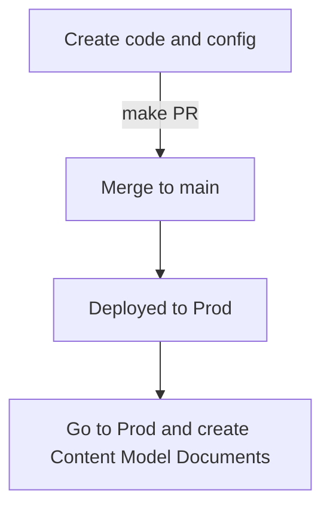

# Content Models and Site Documentation

When possible, documentation about entities should live in Drupal.  Entities
include Content types, blocks, paragraphs, taxonomy, menus, media and the fields
used in those.

We leverage the [Content Model Documentaion module](https://www.drupal.org/project/content_model_documentation) to do most of this.  It is based on two concepts:

1. Don't document what can be read directly from Drupal. [Reports -> Content Model](https://prod.cms.va.gov/admin/reports/content-model).
2. Document what can not be read directly from Drupal (who, when, where, why). [Structure -> Content Model Documents](https://prod.cms.va.gov/admin/structure/cm_document)

## What to document

* New content types or changes to how a content type is used.
* New vocabularies
* New blocks
* New menus
* New Views
* Fields that have an undetectable use (not all fields) such as being pulled from
  or pushed to somewhere else.
* New modules, why they were added.

Basically we want to document:
* What team owns it.
* When it was implemented.
* Why it was implemented.
* Links to external docs of all kinds (designs, research, epics...)
* Links to Knowledge Base articles.
* Other info like product name changes (ie. Learning center is not Resources and Support)

## Documentation Workflow
  In order to document an entity, the entity has to exist on prod.  So the code
  that creates an entity will have to land on prod before it can be documented.

[Table of Contents](../README.md)
