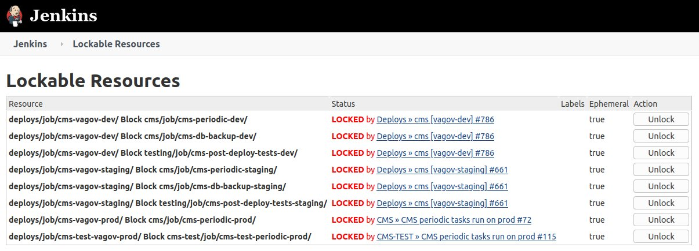

# Jenkins Job Blocking with Lockable Resources Plugin

## What is the Lockable Resources Plugin ?

This plugin allows defining lockable resources (such as printers, phones, computers, etc.) that can be used by builds. If a build requires a resource which is already locked, it will wait for the resource to be free. This effectively creates job blocking.

### Using a Resource in a Pipeline Job

When the lock step is used in a Pipeline, **if the resource to be locked isn't already defined in the Jenkins global configuration, an ephemeral resource is used**: These resources only exist as long as any running build is referencing them.

The above bolded section is a crucial point to pay attention to. This avoids using Jenkins Global configuration to define resources that can be locked and to maintain as much configuration in code as possible. Resources to be locked are defined in Jenkinsfiles called by the job itself. Consequently this means that a pair of jobs that should block eachother must define the same resource name *precisely* in their Jenkinsfiles.

### Purpose of Lockable Resources for Job Blocking

Defined in va.gov-cms issue [#2890](https://github.com/department-of-veterans-affairs/va.gov-cms/issues/2890) Prod Database Backup jobs and Periodic Server Tasks **should not** run while a Production Deployment is in progress. Without this, multiple jobs that depend on the same underlying infrastructure can and will fail.

This has been extended to all environments (Prod,Staging,Dev) and CMS-TEST Infrastructure.

### References

https://plugins.jenkins.io/lockable-resources/

https://github.com/jenkinsci/lockable-resources-plugin

https://github.com/department-of-veterans-affairs/va.gov-cms/issues/2890

## Jobs That Implement Lockable Resources

This applies to CMS Infrastructure across all environments (Dev,Staging,Prod) as well as CMS-TEST Infrastructure and environments:

1. deploys/job/cms-vagov-[ENV]/
1. cms/job/cms-test-periodic-[ENV]/
1. testing/job/cms-post-deploy-tests-[ENV]/
1. cms/job/cms-test-db-backup-prod/

The above numerated list consists of partial URLs that can be added at the end of http://jenkins.vfs.va.gov/job/ replacing the desired environment for [ENV]. Additionally swaping `cms-test` for `cms` will open test infrastructure jobs.

For Example:

http://jenkins.vfs.va.gov/job/deploys/job/cms-vagov-dev/

http://jenkins.vfs.va.gov/job/deploys/job/cms-test-vagov-dev/


## How to View Job Resource Lock Status ?

The Lockable Resources Plugin provides a page to view what resources are locked and which job obtained that lock.

http://jenkins.vfs.va.gov/lockable-resources/



## How does Job Locking Work ?

From the above picture it's possible to identify:
1. Resource Name that is locked.
1. Status of that lock and the **job that obtained it**.
1. Label property. For va.gov-cms use this is always Ephemeral/true.
1. Lock override option.

The key to understanding job locking is **1. Resource Name that is locked.** The resouce name is parameritized in each Jenkinsfile to dynamically fill in the environment identifier. Resource names follow this pattern:

`partial/path/to/job Block partial/path/to/job`

### For example:

`deploys/job/cms-vagov-dev/ Block cms/job/cms-test-periodic-dev/`

**deploys/job/cms-vagov-dev/** is the CMS Dev deployment job.

**cms/job/cms-periodic-dev/** is the CMS Periodic Tasks job run on servers.

**Generated Resource Name:** deploys/job/cms-vagov-dev/ Block cms/job/cms-periodic-dev/

Each of these jobs generates the same resource lock name and attempts to place a lock on that resource. If one of these two (2) jobs has already placed a lock on the shared resource name, it will wait for the lock to be removed before continuing.

CMS Deploy job code snippet:

```
  options {
    ansiColor('xterm')
    // View resource locks in Jenkins here http://jenkins.vfs.va.gov/lockable-resources/
    // View documentation on job locking system here:
    // https://github.com/department-of-veterans-affairs/va.gov-cms/blob/master/READMES/devops/jenkins-job-locking.md
    lock(extra: [[resource: "deploys/job/cms-vagov-" + ENV_MAPPING["${environment}"] + "/ Block cms/job/cms-periodic-" + ENV_MAPPING["${environment}"] + "/"],
                 [resource: "deploys/job/cms-vagov-" + ENV_MAPPING["${environment}"] + "/ Block cms/job/cms-db-backup-" + ENV_MAPPING["${environment}"] + "/"],
                 [resource: "deploys/job/cms-vagov-" + ENV_MAPPING["${environment}"] + "/ Block testing/job/cms-post-deploy-tests-" + ENV_MAPPING["${environment}"] + "/"]
    ])
  }
```

CMS Periodic job code snippet:

```
    options {
        ansiColor('xterm')
        // View resource locks in Jenkins here http://jenkins.vfs.va.gov/lockable-resources/
        // View documentation on job locking system here:
        // https://github.com/department-of-veterans-affairs/va.gov-cms/blob/master/READMES/devops/jenkins-job-locking.md
        lock(extra: [[resource: "deploys/job/cms-vagov-${env_mapping}/ Block cms/job/cms-periodic-${env_mapping}/"]])
    }
```
