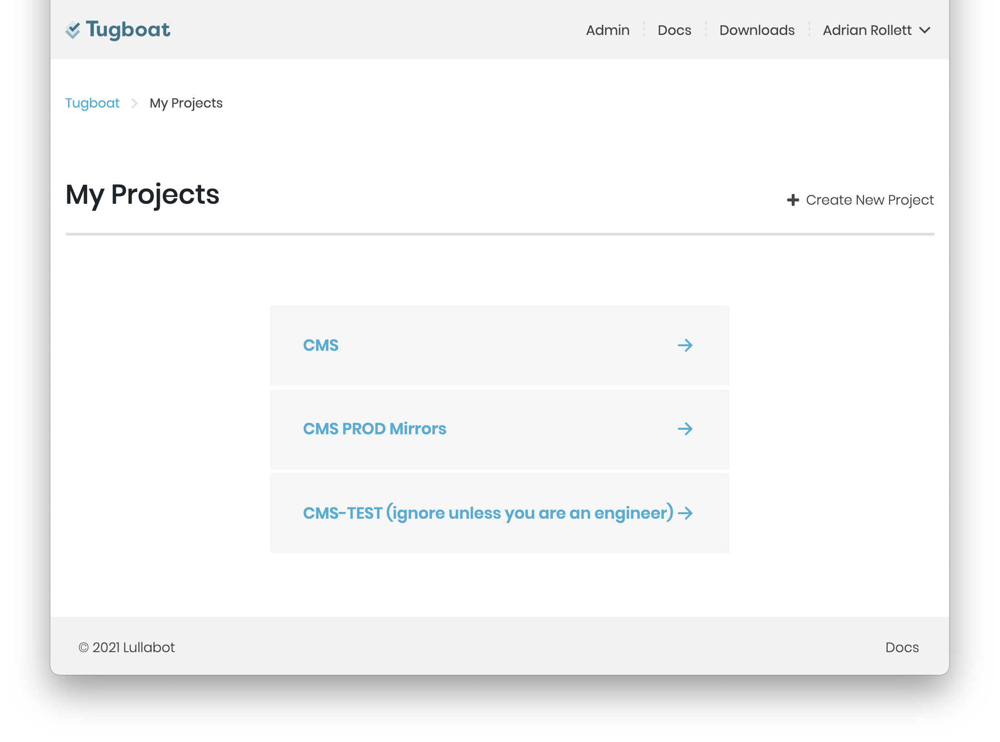

# Environments & the Content Build Process

To enable end to end quality analysis, from the VA.gov CMS through to the public facing website, new feature review, and stakeholder demonstrations, multiple joined CMS/WEB environments may be created by any user with access to Tugboat.

The following table lists all environments and CMS/WEB sites used in the development process for VA.gov:

| Environment                                                 | Drupal (CMS)                                        | Frontend (FE / WEB / Static)                                                                                                                                                                                | Management                                                                                |
| ----------------------------------------------------------- | --------------------------------------------------- | ----------------------------------------------------------------------------------------------------------------------------------------------------------------------------------------------------------- | ----------------------------------------------------------------------------------------- |
| **PROD**  Live Site                                      | [prod.cms.va.gov](https://prod.cms.va.gov)          | [www.va.gov](https://www.va.gov)                                                                                                                                                                            | [BRD: Jenkins](http://jenkins.vfs.va.gov/job/deploys/view/Prod/job/cms-vagov-prod/)       |
| **STAGING**   Pre-release testing.                       | [staging.cms.va.gov](https://staging.cms.va.gov)    | [staging.va.gov](http://staging.va.gov)                                                                                                                                                                     | [BRD: Jenkins](http://jenkins.vfs.va.gov/job/deploys/view/Staging/job/cms-vagov-staging/) |
| **DEV**   Latest approved code.                          | [dev.cms.va.gov](https://dev.cms.va.gov)            | [dev.va.gov](https://dev.va.gov)                                                                                                                                                                            | [BRD: Jenkins](http://jenkins.vfs.va.gov/job/deploys/view/Dev/job/cms-vagov-dev/)         |
| [LOCAL](http://va-gov-cms.lndo.site)   Local development | [va-gov-cms.lndo.site](http://va-gov-cms.lndo.site) | [va-gov-cms.lndo.site](http://va-gov-cms.lndo.site)   [va-gov-cms.lndo.site/static](http://va-gov-cms.lndo.site)   [va-gov-cms.lndo.site/$URL?\_format=static_html](http://va-gov-cms.lndo.site/$URL) |
| [CI / PR](1)   Pull Requests & Automated Testing         | pr###-{hash}.ci.cms.va.gov                          | web-{hash}.ci.cms.va.gov   pr###-{hash}.ci.cms.va.gov/static   pr###-{hash}.ci.cms.va.gov/$URL?\_format=static_html                                                                                   | [CMS-CI: Tugboat](1)                                                                      |
| [Demos](2)   Demos & Training                            | cms-{hash}.demo.cms.va.gov                          | web-{hash}.demo.ci.cms.va.gov   cms-{hash}.demo.cms.va.gov/static   cms-{hash}.demo.cms.va.gov/$URL?\_format=static_html                                                                              | [CMS-CI: Tugboat](1)                                                                      |

For more information on how access these environments see [Access](./access.md)

## What is an Environment?

_Environments_ are copies of the production site that are running newer
code or have different content that needs to be tested before going live.

_Environments_ can also be used for demonstrations or training, without worrying
about disrupting production content.

Each _Environment_ has both a _CMS_ and a _WEB_ site. The _CMS_ is a content management
system built with Drupal, and the _WEB_ site is a static HTML site, built with Metalsmith.

The _WEB_ build process consumes the content from the _CMS_ in the same environment.

## Important Concepts

- Each _WEB_ site is made up of generated "static" files. This means that the _WEB_ site reflects the content from the CMS _at the time the WEB Build process was run_.
- _CMS_ Editors will not see changes in the _WEB_ site until a "WEB Build" is triggered and the process completes successfully.
- The _WEB_ site will not be accessible until at least one "WEB Build" has run successfully. This happens automatically for CI environments, but not yet for Demo environments. If you get an error such as "Forbidden" when visiting the _WEB_ site, try running the _Rebuild WEB_ process again.

### Step-by-step Instructions

1. Visit [https://tugboat.vfs.va.gov/](https://tugboat.vfs.va.gov/) and click on the "GitHub" link to log in with GitHub.

   

2. Click the CMS link and the click the "CMS Demo Environments" to visit the Demos page.

   

3. Scroll down to the "Base Previews" heading and select "Clone" from the "Actions" menu.

   

4. Your demo environment has been created. It will be titled "master". Scroll to the top of the page, click on the "Settings" link for your new environment, and give it a title starting with your initials and a hyphen. Then, click the "Save Configuration" button.

   

5. If you wish to copy [prod.cms.va.gov](http://prod.cms.va.gov) using the latest content, do not change any additional options.

6. Click the "Preview" button for your environment to visit it.

   

**NOTE:** The WEB site for this environment will not work until you trigger a WEB Build process on the "Release Content" page.

## WEB Build Process

Within each environment, the static HTML for the _WEB_ site is occasionally
"rebuilt" so that the latest content from that environment's _CMS_ is used.

The _WEB_ build process is tested in the CI system to ensure compatiblity with the
CMS content schema.

The _WEB_ build process is triggered automatically by certain actions in the CMS
or manually via the [command line](#cli-build).

### Build Triggers

The _WEB_ instance of an environment is rebuilt when any of the following actions take place in the _CMS_:

- Facility Alert or Individual Facility Operating Status is created or updated.
- The "Rebuild WEB" button is pressed.
- @TODO: Document all current build triggers.

_Note to Developers:_ Keep this list up to date to help content editors understand the process.

### Rebuilding Environments Manually

There is a special button and form for rebuilding VA.gov environments. Use this
to manually trigger either a WEB or CMS rebuild (or both), and optionally check
out different code.

#### Step-by-step Instructions

1. Find the environment you would like to build in the [CMS-CI](1) site, and go to the preview.
2. Hover over the "Content" admin menu, and then click "Release Content".

   

3. If you wish to just trigger a WEB rebuild with the existing content, do not change any other options.

   

   **For advanced users and developers:**

   1. If you wish to change the branch of the WEB project, click "Select a different frontend branch/pull request". Start typing to search by the name of the branch or pull request you wish to use.

   

4. Press the "Release content" button. You will see the status of your build under the "Wait for the release to complete" heading. You may view the build logs by clicking the "View logs" link.

   

5. Once the REBUILD process is complete, you can click the "Go to front end" button under the "Access the frontend environment" heading.

   

6. That's it! If the process completed, you should see a site that looks like VA.gov.

## What is an Environment?

_Environments_ are copies of the production site that are running newer
code or have different content that needs to be tested before going live.

_Environments_ can also be used for demonstrations or training, without worrying
about disrupting production content.

Each _Environment_ has both a _CMS_ and a _WEB_ site. The _CMS_ is a content management
system built with Drupal, and the _WEB_ site is a static HTML site, built with Metalsmith.

The _WEB_ build process consumes the content from the _CMS_ in the same environment.

## Important Concepts

- Each _WEB_ site is made up of generated "static" files. This means that the _WEB_ site reflects the content from the CMS _at the time the WEB Build process was run_.
- _CMS_ Editors will not see changes in the _WEB_ site until a "WEB Build" is triggered and the process completes successfully.
- The _WEB_ site will not be accessible until at least one "WEB Build" has run successfully. This happens automatically for CI environments, but not yet for Demo environments. If you get an error such as "Forbidden" when visiting the _WEB_ site, try running the _Rebuild WEB_ process again.

## Creating new Environments

Within the [CMS-CI](1) platform, in "CMS Demo Environments", users can create new environments by cloning the "master" Base Preview.

## Hosting Architecture

All environments are hosted on VA GovCloud in AWS GovCloud.

The primary environments, DEV, STAGING, and PROD, are hosted in the _BRD_ system.

Pull Request Environments and Ad Hoc environments are hosted in the _CMS-CI_ system.

SOCKS proxy or PIV+GFE hardware is required for accessing VA internal network.

### BRD: Jenkins

> Build, Release, Deploy

[jenkins.vfs.va.gov](http://jenkins.vfs.va.gov/)

- Source Code: https://github.com/department-of-veterans-affairs/devops/tree/master/ansible/build/roles/cms
- Runs Continuous Integration for about a dozen different applications with different requirements, including `vets-website`, `vets-api`, `cms`, and soon `cms-ci`.
- BRD Process is standardized across apps using Ansible playbooks and roles. See the [DevOps Repo Documentation](https://github.com/department-of-veterans-affairs/devops/blob/master/README.md) for more information.

  - The "Build" process creates the entire server image and permantently tags and archives it as an AMI.
  - The "Deploy" process delivers those images to the 3 "environments", _DEV, STAGING, and PROD_ and runs whatever
    hooks are needed.
  - The "Release" process continuously delivers code to each BRD Environment

    - Primary branch commits are automatically deployed to DEV and STAGING Environments.
    - Git Tags and GitHub Releases are created automatically if those commits pass testing.
    - "Environments" in the context of **BRD** are really different networks.
    - The "servers" that actually run the apps are activated AMI images, placed into the desired "environment".

### CMS-CI: Tugboat

> CI Platform

[tugboat.vfs.va.gov/](https://tugboat.vfs.va.gov/)

- _CMS-CI_ refers to the VA's implementation of Tugboat.
- Provides an environment per Pull Request, and allows creation of ad-hoc environments with any name, on any desired branch or Pull Request.
- Provides a Web UI for getting information and managing these environments
- Installed with open source Ansible roles, plus a custom playbook.
- Deployment of new releases of CMS-CI and Tugboat is handled by BRD in way very similar to CMS.
- Provides a complete SDLC pipeline for Drupal code:
  - Creates new environments when a PR is open.
  - Automatically tests the environment and passes status to GitHub to allow or block merging.
  - Destroys and rebuilds PR Environments and runs the full test suite again on every git push.
  - If the PR is merged or closed, environment is destroyed.
  - Notifies GitHub of deployment success or failure, with lnks to the environments.
- Includes the FE/WEB Build process in the Drupal CI pipeline.
  - Front-end WEB project can be built inside PR environments by using the "Release Content" page.
  - End-to-end testing of CMS+WEB with Behat and Cypress:
    1. Make CMS updates: Change content, publish state, etc.
    1. Run WEB build command to rebuild static assets.
    1. Confirm CMS change is visible in WEB static assets.
- Runs on a single EC2 instance.

#### SSH access to CI environments

To access a CI environment via ssh, go to that environment's page on Tugboat and click the "Terminal" link on the line for the "php" service.

# Resources

- https://va-gov.atlassian.net/wiki/spaces/VAGOV/pages/103448589/VA.gov+CMS+DevOps+2.0+Architecture+Notes
- https://va-gov.atlassian.net/wiki/spaces/VAGOV/pages/28770332/CMS+Infrastructure+CI+CD+Architecture+Proposal+3

[Table of Contents](../README.md)

[1]: https://tugboat.vfs.va.gov/
[2]: https://tugboat.vfs.va.gov/5ffe2f4dfa1ca136135134f6
