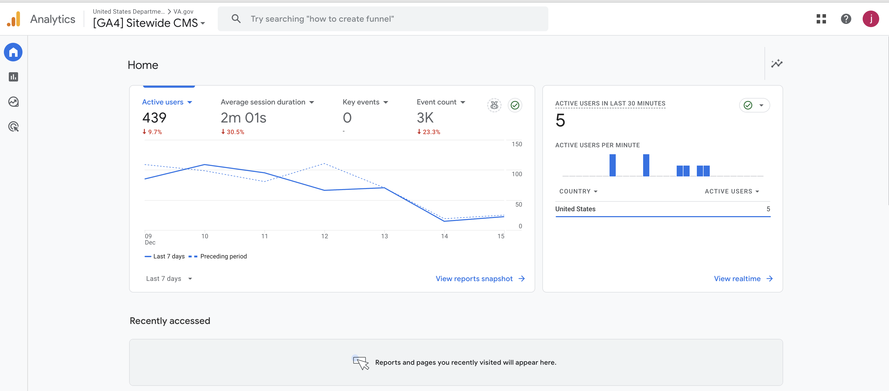

# Google Analytics 4 - Glossary Terms

The goal of this document is to provide a guide for VA users to navigate the Google Analytics 4 (GA4) dashboard. While this file will go through the most pertinent items in our dashboard, an exhaustive list of terms can be found here: https://www.lovesdata.com/blog/google-analytics-glossary

## Landing Page - Home Landing Page

This is the initial landing page for when you come to the analytics url. It provides a snapshot of what google considers to be key items for your attention. Per the advice of the sitewide analytics team, this page is typically not all that useful to your interests. It gives the past week's data as reference.

## Landing Page - Reports Snapshot

This landing page for your reports is a bit more useful, providing longer trends and updates on any of your created metrics at a glance. A more in-depth description can be found here: https://support.google.com/analytics/answer/10659091?hl=en&utm_id=ad

## Landing Page - Library

The Library landing page (seen on the bottom left of your screen once you are inside the reports section) is where you can manage your collections and custom reports. GA4 supplies you with stock options for both collections and reports, but it is important for you to create one that makes sense for your use case.

## Collection - Life cycle - Engagement overview

Each collection you create will populate the sidebar navigation and provide the pages associated with the directories and reports you include. For example, we are taking a look at the engagement overview page within the "Life cycle" collection. We have provided GA4 with some parameters and metrics we would like to track for this collection (like average engagement time and engaged sessions per active user), and GA4 gives us an interactive graph to visualize those metrics over a time period we can specify.

## Terms

### Active Users

Active users is the primary metric used in GA4 to show you how many people have visited our site. To be considered active, a user needs to have an engaged session (a user on the site longer than 10 seconds) or be reported as a new user (note: being listed as new would also include people who have cleared their cookies or on a different device).

### Views

Views collect the total number of times events have been collected. For example, a user who navigates to the ‘about us’ page, then the ‘contact us’ page, and then back to the ‘about us’ page will result in two views of the ‘about us’ page and one view of the ‘contact us’ page.

### Events

GA4 treats all data as "events". If you interact with a webpage at all, that is an event. There are automatic events that google collects for you (like page_view, scroll, click, and more), and there are also ways to create custom events and add recommended events for tracking purposes. Here's a helpful guide on creating custom events: https://www.lovesdata.com/blog/google-analytics-4-events#custom-events

### Session

A session is when a user visits a page and logs an event (this is done as soon as a user views the page and is tracked by the session_start event by GA4). A session will include any and all events a user does until either they have stayed on the same page for over 30 minutes (in which time a new session will be created) OR they navigate away from the page.

### Bounce Rate

A bounce rate is the percentage of sessions that last less than 10 seconds, have no key event (previously called a conversion), and/or only include one page view (the initial page view upon landing on the page). Think of this as the percentage of users who are not really engaged on the site.

### Key Event

Key events are used to report actions that you have chosen that align with your business objectives. After choosing one or several key events, you can then see this number surfaced in your reports. This will give you an idea of if your users are interacting with the site in your predicted ways.

### Filter

You can add filters to reports to further refine your results. For example, I can add a filter to exactly match the prod.cms.va hostname to make sure I have excluded metrics from lower or unwanted environments as seen in the image below. NOTE: Filters are not exported to reports and will only persist on a user basis. If I create a filter, I cannot share that with you directly in the dashboard (I can, however, export the filtered report or guide you how to create that filter for yourself).

