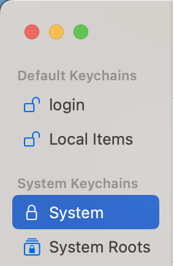

# HTTPS Setup

## HTTPS browser setup for production usage
All computers in VA already have this setup, if you are using a non-VA laptop for development you will need to trust the VA Root Certificate Authority (CA) in your browser(s).

### Download certificates, right click "save as"
* http://crl.pki.va.gov/PKI/AIA/VA/VA-Internal-S2-RCA1-v1.cer
* http://crl.pki.va.gov/PKI/AIA/VA/VA-Internal-S2-ICA1-v1.cer
* http://crl.pki.va.gov/PKI/AIA/VA/VA-Internal-S2-RCA2.cer

If you see a message from your browser like the following:

Click the "^" button and select "Keep."

### macOS (as of 13.4)
1. Import the certificates.
    1. Open Keychain Access
    1. Select "System" under System Keychains (in sidebar)
    
    1. Select "Import Items..." from File menu. (Shift-Command-I)
    1. Select the three .cer files above.
    1. They should now appear in your list of certificates under the "Keychain Access" view
1. Trust each certificate.
    1. For each of the three certificates, select it
    1. File > Get info (Command-I)
    1. Expand the "Trust" view
    1. In the "When using this certificate" popup button, select "Always Trust".
    1. Close the "Get Info" window, which will prompt a password save.
1. You may need to restart your browser.

### Linux

#### Chrome
1. Go to chrome://settings/certificates?search=https
1. Click "Authorities"
1. Click "Import" and select VA-Internal-S2-RCA1-v1.cer file downloaded above

#### Firefox
1. Go to about:preferences#privacy, scroll to bottom
1. Click "View Certificates"
1. Click "Authorities" tab
1. Click "Import"
1. Import both files downloaded above

### Windows

#### Chrome
1. Open settings
1. Click "Privacy and Security" in the left sidebar
1. Click "Security" in the main section
1. Scroll down and click on "Manage certificates" under the Advanced section
1. Under the "Intermediate Certificate Authorities", click "Import" and select VA-Internal-S2-ICA1-v1.cer downloaded above
1. Under the "Root Certificate Authorities", click "Import" and select VA-Internal-S2-RCA1-v1.cer downloaded above
1. You may need to restart your browser (all windows) or your machine in order to for these certs to become active.

## HTTPS testing (locally)

You can't test with the VA cert locally but you can use ddev's self-signed cert. If you need to test the actual cert locally contact the DevOps team to help you setup the vagrant build system to get HTTPS working with VA CA.

This should "just work" if you installed ddev using the documented [installation instructions](https://ddev.readthedocs.io/en/stable/#installation) (including the `mkcert` commands). After you've installed ddev and run the `mkcert` commands, you'll need to restart your browser(s).
