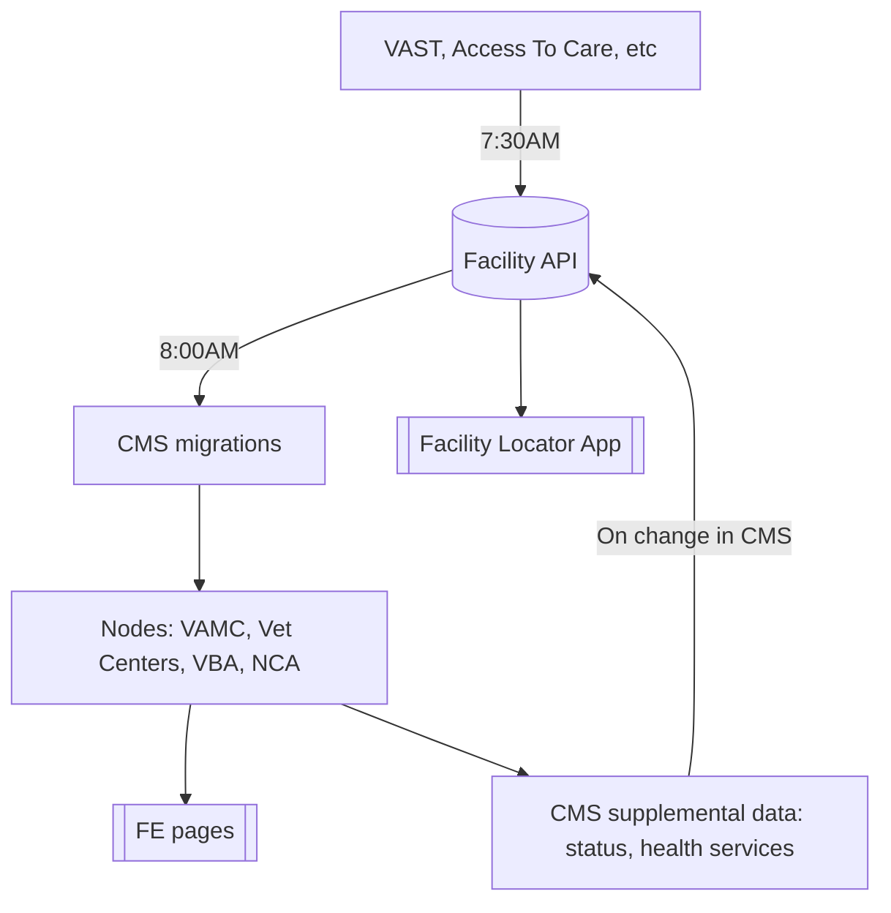

# Migrations: Facilities

1. [Facility Migrations](#facility-migrations)
   1. NCA (National Cemetery Administration) Facilities
   1. VAMC (VA Medical Center) Facilities
      - [System and Facility Health Services](#system-and-facility-health-services)
   1. VBA (Veterans Benefits Administraion) Facilities
   1. Vet Centers, Mobile VCs, and Vet Center Outstions
1. [Status Changes to Lighthouse](vamc-facilities.md#status-changes-to-lighthouse)

## Data Flow


## Facility Migrations

Facility migrations occur once per day and the six types of facilities are updated
with any data from the [Facility API](interfaces.md#facilities-api) including
the creation of new facilities, updating titles, addresses, etc.  The facility
is connected to the facility API by its unique "Facility Locator API ID"

### CrUD Operations

#### Create

When a new facility appears in the Facility API, it is created in the CMS in draft state.  It will need the following operations performed.  It is flagged as "new" and appears on the [Flagged dashboard](https://prod.cms.va.gov/admin/content/facilities/flagged).  An email message is sent to CMS Support to kick off the [New Facility Runbook](https://github.com/department-of-veterans-affairs/va.gov-cms/issues/new?assignees=&labels=Change+request&template=runbook-facility-new.md&title=New+Facility%3A+%3Cinsert_name_of_facility%3E).

#### Update

Updates to facility address or hours are updated and maintain the current moderation state of the facility node.  If the node is published, the new changes will become published.  These changes are routine and need no intervention.
If a title changes, the title of the facility updates but the name change does NOT.  In the event of a title change, the facility is flagged and appears on the [Flagged dashboard](https://prod.cms.va.gov/admin/content/facilities/flagged) to kick off the [Facility Name Change Runbook](https://github.com/department-of-veterans-affairs/va.gov-cms/issues/new?assignees=&labels=Change+request&template=runbook-facility-name-change.md&title=Facility+name+change%3A+%3Cinsert_name%3E).


#### Delete

When a facility is removed from the Facility API, a nightly scan (drush va_gov_migrate:flag-missing-facilities) reveals that it has been removed and flags it "Removed from source".  The flag makes it appear on the [Flagged dashboard](https://prod.cms.va.gov/admin/content/facilities/flagged) to kick off the [Facility Closed Runbook](https://github.com/department-of-veterans-affairs/va.gov-cms/issues/new?assignees=&labels=Change+request&template=runbook-facility-closed.md&title=Facility+closed%3A+%3Cinsert_name%3E).

  The nightly migrations are handled as part of our tasks-periodic.yml and
are triggered by Jenkins at midnight.  Revisions for any saves are created and attributed
to the user "CMS Migrator"

  1. NCA (National Cemetery Administration) Facilities - va_node_facility_nca
  2. VAMC (VA Medical Center) Facilities - va_node_health_care_local_facility
  3. VBA (Veterans Benefits Administraion) Facilities - va_node_facility_vba
  4. Vet Centers - va_node_facility_vet_centers
     1. Mobile Vet Centers - vet_center_mobile_vet_center
     2. Outstations - vet_center_outstation
     3. Vet Center Community Access Points - vet_center_cap The CMS is the source of truth for these and will be pushing data to the facility API not migrating from it.


### System and Facility Health Services
These are created and run as needed as part of the VAMC Upgrade teams effort to get all the services into the CMS.  VAMC upgrade team will provide separate CSVs, one for system health services and one for facility health services.

There are dependencies in the migration that will cause a migrated item to be skipped and create a migration message:
* System Health Service Dependencies
   * National Service Taxonomy term must exist.
   * The System must exist.
* Facility Health Dependencies
   * System Health Service must exist (which is why the system health service migration must be run first)
   * VAMC facility must exist.

A migration should not be considered complete if there are ANY migrate messages logged.

### VBA Facilities VBA Database Migration
The VBA database maintained by Dave Conlon contains unique data that updates VBA Facility content type through the "Node - Veterans Benefits Administration Facility (Database extract)" (`va_node_facility_vba_db_extract`) migration. The fields updated are
- "Non-VA location official name" (`field_non_va official_name`)
- "Non-VA location URL" (`field_non_va_location_external_url`)
- "Parent office" (`field_office`)
- "Section" (`field_administration`)
- "Shared VHA location" (`field_shared_vha_location`)

The CSV export is provided in the VBA Modernization Microsoft Teams channel. To prepare the data for import, follow these steps (_Note: columns letters are reset after each removal._):
- Remove columns C (Facility_Type) - AL (Website_URL).
- Remove columns D (ro_facility_url) and E (Country)
- Remove column G (Phone)
- Export as CSV with comma field delimiters and double quotes enclosures/text delimiters.
- Save the file as `vba_facility_db_export_current.csv` in `docroot/modules/custom/va_gov_migrate/data/`, replacing the document already there.


### Migration Commands
* `ddev drush migrate:status {migration_id}`  - gives the status of the migration. Number of items total, number unprocessed.
* `ddev drush migrate:reset-status {migration_id}`  - Resets a migration that may have not completed due to a fatal error.
* `ddev drush migrate:rollback {migration_id}`  - Rolls back all items tracked by the migration.
* `ddev drush migrate:messages {migration_id}` - List any messages from the last run of the migration. Subsequent runs of the migration will remove ald messages.  When run in the UI, this list only includes any messages from the last batch (which my only be the last 25 things migrated).
*  Useful options
   *  `--id-list={ID}`  - Limits the command to just a specific row/item in the migration.   Useful for rolling back and re-migrating a specific troublesome item. The ID is the row ID based on what unique ID is defined in the migration.
   *  `--limit={quantity}`  - limits the action to a specific number of items.

#### Migration Settings (settings.local.php)
For these migrations to function, you'll need to obtain a Facility API Key from a member of the development team and place the key, along with the following code, into your settings.local.php file. This file should be located in `docroot/sites/default/settings.local.php`.

```php
<?php
$settings['post_api_endpoint_host'] = 'https://sandbox-api.va.gov';
$settings['post_api_apikey'] = 'PASTE_KEY_HERE';

$facility_api_urls = ['https://sandbox-api.va.gov/services/va_facilities/v0/facilities/all'];
$facility_api_key = $settings['post_api_apikey'];
$facility_migrations = [
  'va_node_health_care_local_facility',
  'va_node_facility_vba',
  'va_node_facility_nca',
  'va_node_facility_vet_centers',
  'va_node_facility_vet_centers_mvc',
  'va_node_facility_vet_centers_os',
];

foreach ($facility_migrations as $facility_migration) {
  $config["migrate_plus.migration.{$facility_migration}"]['source']['urls'] = $facility_api_urls;
  $config["migrate_plus.migration.{$facility_migration}"]['source']['headers']['apikey'] = $facility_api_key;
}
```

###  Workflow
  1. Edit or create a new migration configuration in docroot/modules/custom/va_gov_migrate/config/install
  2. Use `ddev migrate-sync` to copy the config into config/sync imported it and export it again.  Always work in `va_gov_migrate/config/install` and then sync.  This preserves any comments in the migration yml.
  3. Preflight any new data from the VAMC upgrade team in libre office by importing the CSV with the import config set to separator: ; and encapsulation: '.  Look for jumped columns missing data or the appearance of wrapping quotes.
  4. Append the data to an existing CSV or add it as new (if you are dealing with thousands, add it as new.)  Name the file as a match to the id of the migration you are creating.
  5.  Run the System Health Service migration.  Look for presence of migrate messages.  The messages will indicate the problems with the data.  Fix, rollback, repeat until there are no messages created and the row count of the data, matches the created count.
  6. Run the Facility Health Service migration.  Look for messages. The messages will indicate the problems with the data.  Fix, rollback, repeat until there are no messages created and the row count of the data, matches the created count.

----

[Table of Contents](../README.md)
