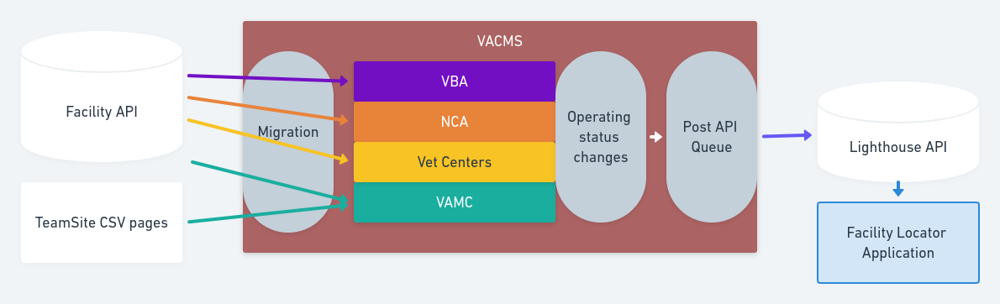

# Migrations: Facilities

1. [Facility Migrations](#facility-migrations)
   1. NCA (National Cemetery Administration) Facilities
   1. VAMC (VA Medical Center) Facilities
      - [VAMC Status](#vamc-status-migration)
   1. VBA (Veterans Benefits Administraion) Facilities
   1. Vet Centers
1. [Status Changes to Lighthouse](vamc-facilities.md#status-changes-to-lighthouse)

## Facility Migrations
Facility migrations occur nightly and the four types of facilities are updated
with any data from the [Facility API](interfaces.md#facilities-api) including
the creation of new facilities, updating titles, addresses, etc.   The facility
is connected to the facility API by its unique "Facility Locator API ID"
(field_facility_locator_api_id).  These migrations do not handle removing or
deleting any facilities. A facility that needs to be removed, must be deleted by
hand.  The nightly migrations are handled as part of our tasks-periodic.yml and
are triggered by Jenkins.  Revisions for any saves are created and attributed
to the user "CMS Migrator"

  1. NCA (National Cemetery Administration) Facilities - va_node_facility_nca
  1. VAMC (VA Medical Center) Facilities - va_node_health_care_local_facility
  1. VBA (Veterans Benefits Administraion) Facilities - va_node_facility_vba
  1. Vet Centers - va_node_facility_vet_centers

### VAMC Status Migration
VAMC Statuses are updated by a separate migration
(va_node_health_care_local_facility_status) that runs every hour.  It grabs
[multiple CSV sources](../docroot/modules/custom/va_gov_migrate/config/install/migrate_plus.migration.va_node_health_care_local_facility_status.yml) (one per system) which are
scraped from TeamSite and updates the "Operating status"
(field_operating_status_facility) and "Operating status - more info"
(field_operating_status_more_info)  [Changes to operating status also get pushed
 to Lighthouse](vamc-facilities.md#status-changes-to-lighthouse).

[Table of Contents](../README.md)
