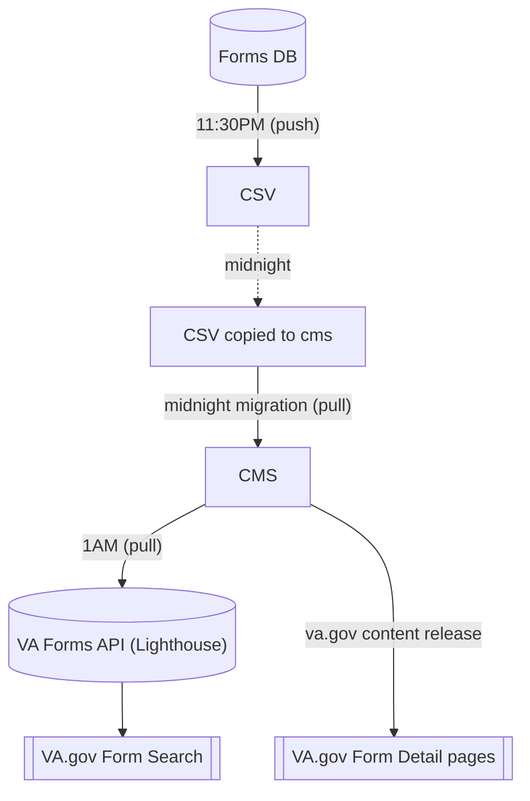

# Migrations: Forms

1. [Data Flow](#data-flow)
1. [Forms Migration](#forms-migration)
   1. CrUD
   1. [Source](#source-forms-db)
1. [CMS Forms Data to Lighthouse](#cms-forms-data-to-lighthouse)
1. [Points of Failure](#points-of-failure)

## Data Flow

All times in ET.

## Forms Migration

Forms migration (va_node_form) occurs nightly. The Form landing page nodes (va_form)
are connected to the Forms DB (source) by its unique "rowid". "rowid" is a field in the source db and is used as the unique identifier through the whole process.
  * **Create:**  Any forms that appear new in the source are created in the CMS as a "VA form" with a moderation state of "draft".  A notification is sent to #va-forms channel in Slack.
  * **Update:**  Any form data that changes in the source is updated in the existing "VA form" without a change to its current moderation state.
    If either the form's title or url/filename change, a notification is sent to #va-forms channel in Slack.
  * **Delete:**  Any form in the source that is flagged with the "Deleted" field will have its corresponding "VA form" node unpublished by having its moderation state changed to "archived".
    This logic is handled in _va_gov_migrate_process_va_form().  A notification is sent to #va-forms channel in Slack.

The nightly migrations are handled as part of our tasks-periodic.yml and are triggered by Jenkins at midnight.  Revisions for any saves are created and attributed to the user "CMS Migrator".

Notifications are handled in va_gov_workflow/src/EventSubscriber/EntityEventSubscriber.php

### Source: Forms DB

The Forms DB is the source of the form data migration. Each night at 11:30PM ET the Forms DB runs an export on cron to create a CSV file located at
http://vaww.webdevi.va.gov/vaforms/VAForms_DataExtract/VAForms_FormsData.txt
Our [task-periodic job](https://github.com/department-of-veterans-affairs/va.gov-cms/blob/main/tasks-periodic.yml#L52) copies that file and places it here
https://prod.cms.va.gov/sites/default/files/migrate_source/va_forms_data.csv
so that it can be available to all our network environments (CI & BRD).
To run it in sandboxes it will need to be pulled down with our file sync command.

#### Catastrophic safeties:
  * If the source disappeared, the migration would make no changes to the existing nodes.
  * If a row from the source disappears, the migration makes no change to existing nodes.

## Editorial

There are fields on the "VA form" nodes that are not connected to the migration because they do not exist in the source.  These fields can be edited as needed without being altered by subsequent runs of the migration.  Fields that are controlled by the data in the source are not available to be edited. In the event of bad data from the source (a bad file name or title) a site administrator can edit the fields.  These edits will be overwritten the next time the migration runs if the source row has changed.  This logic is handled in
[_vagov_consumers_modify_va_form_fields()](https://github.com/department-of-veterans-affairs/va.gov-cms/blob/main/docroot/modules/custom/va_gov_consumers/va_gov_consumers.module#L109).

[Forms management View](https://prod.cms.va.gov/admin/content/va-forms) can be used to see the status of forms.

## CMS Forms Data to VA Forms API (Lighthouse)

Lighthouse pulls data from the CMS nightly via GraphQL and makes it available to
[form search "Find a VA form"](https://www.va.gov/find-forms/)Form search and other React widgets through the [VA Forms API](https://developer.va.gov/explore/vaForms/docs/vaForms?version=current)

The timeline for changes to a VA Form looks like this:

1. Forms DB admin adds, edits or deletes a form entry and possibly updates the actual pdf file.
2. 11:30PM: Forms DB performs a full data export to CSV
3. 12:00 midnight: CMS moves the CSV and migrates in any changes.
4. 1:00AM Lighthouse pulls data from CMS and makes it available through Facility API exposed through [https://www.va.gov/find-forms/](https://www.va.gov/find-forms/).
5. Updates to published content end up on VA.gov with the first content-release of the day from the CMS.

## Points of Failure

There are several failures that happen due to loose governance on the Forms DB.  Here are a few of them:

1.  **Effect:**  The original form detail page gets archived, and a new one created as draft.  Seemingly disappearing from the Front End.
**Cause:** New pdf for an existing form added as a new row in Forms DB and the original row flagged as deleted.
**Solution:** Notify VA Forms team (Slack: #va-forms) to contact Forms DB manager to remove the new row and update the original row.
2.  **Effect:**  Link to pdf is broken in FE.
**Cause:** Forms DB updated the filename of the form, but did not push out the new file.
**Solution:** Notify VA Forms team (Slack: #va-forms) to contact Forms DB manager to either push out the new file, or change the filename in the row back to the original.  Filenames are not supposed to change.
3.  **Effect:**  Seems to be a data mismatch somewhere.
**Cause:** See the timeline graphic above.  There are gaps in time where either the CMS has outdated data, or the Front End has data that is out of date with whats in CMS or VA Forms API.
**Solution:** Wait until after the 9AM content releases to see if all is right with the world.  If after that, things are not right, raise it in Slack: #va-forms

----

[Table of Contents](../README.md)
