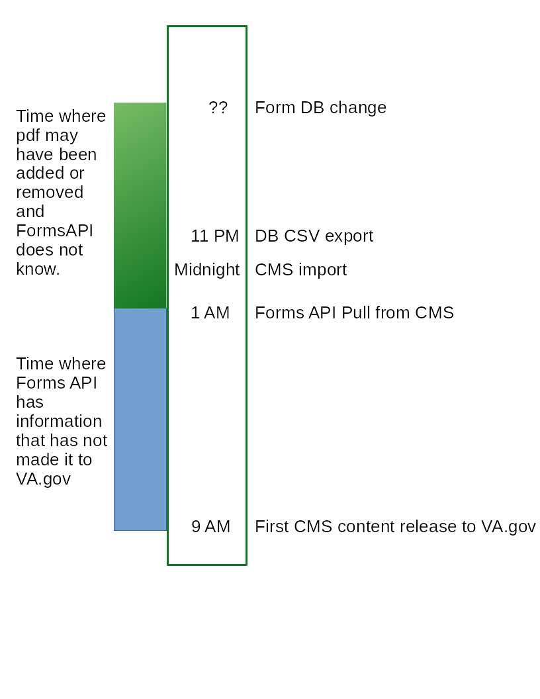

# Migrations: Forms

1. [Forms Migration](#forms-migration)
   1. CrUD
   1. [Source](#source-forms-db)
1. [CMS Forms Data to Lighthouse](#cms-forms-data-to-lighthouse)

## Forms Migration
Forms migration (va_node_form) occurs nightly. The Form landing page nodes (va_form)
are connected to the Forms DB (source) by its unique "rowid".
  * Create:  Any forms that appear new in the source are created in the CMS
    as a "VA form" with a moderation state of "draft".
  * Update:  Any form data that changes in the source is updated in the existing
    "VA form" without a change to its current moderation state.
  * Delete:  Any form in the source that is flagged with the "Deleted" field
    will have its corresponding "VA form" node unpublished by having its
    moderation state changed to "archived".
    This logic is handled in _va_gov_migrate_process_va_form().
The nightly migrations are handled as part of our tasks-periodic.yml and
are triggered by Jenkins at midnight.  Revisions for any saves are created and
attributed to the user "CMS Migrator".

### Source: Forms DB
The Forms DB is the source of the form data migration.  Each night at 11:30PM ET
the Forms DB runs an export on cron to create a CSV file located
http://vaww.webdevi.va.gov/vaforms/VAForms_DataExtract/VAForms_FormsData.txt
Our task-periodic job copies that file and places it here
https://prod.cms.va.gov/sites/default/files/migrate_source/va_forms_data.csv
so that it can be available to all our network environments (CI & BRD).
To run it in sandboxes it will need to be pulled down with our file sync command.
Catastrophic safeties:  If the source disappeared, the migration would make no changes to the existing nodes.

## Editorial
There are fields on the "VA form" nodes that are not connected to the migration
because they do not exist in the source.  These fields can be edited as needed
without being altered by subsequent runs of the migration.  Fields that are
controlled by the data in the source are not available to be edited. In the
event of bad data from the source (a bad file name or title) a site administrator
can edit the fields.  These edits would of course be overwritten the next time
the migration runs at midnight.  This logic is handled in
_vagov_consumers_modify_va_form_fields().

## CMS forms data to Lighthouse
Lighthouse reads data from the CMS nightly via a GraphQL and makes it available to
Form search and other React widgets.

The timeline for changes to a VA Form looks like this:

1. Forms DB admin adds, edits or deletes a form entry and possibly updates the actual pdf file.
2. Forms DB performs a full data export to CSV
3. CMS migrates in any changes.
4. Lighthouse pulls data from CMS and makes it available through Facility API exposed through [https://www.va.gov/find-forms/](https://www.va.gov/find-forms/).
5. Updates to published content end up on VA.gov with the first content-release of the day from the CMS.

[Table of Contents](../README.md)
