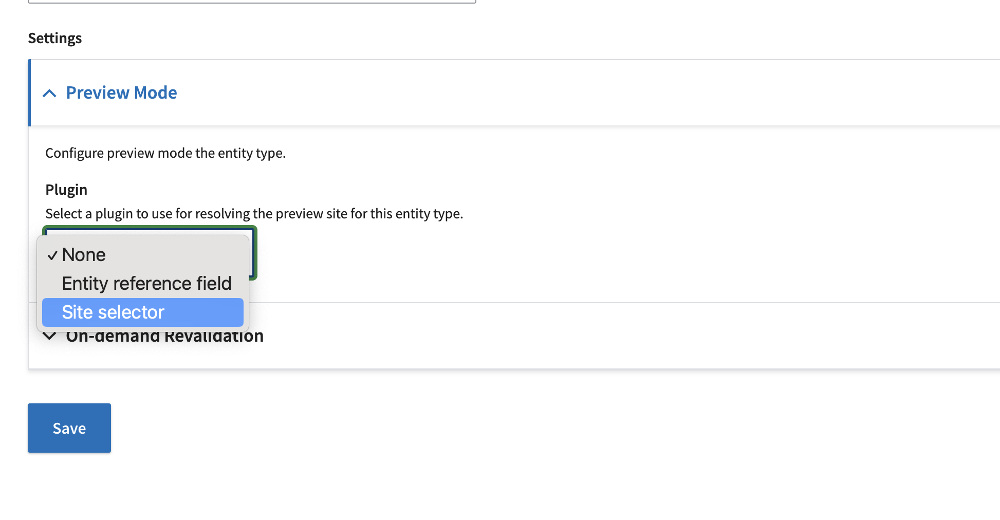

# Next Build and CMS
Next Build is the Next.js-based front-end for CMS content at VA.gov.

@todo: much more detailed content (only documenting preview & flag-related info currently.)

## Next.js content entities
For each content type that should be built by Next Build, there must be a Next.js content entity. The function of this content entity is to let the content type know how it will be previewed. This needs to be specified because preview is handled by a dedicated preview server, which is a separate application from the CMS.

Configuring of [Next.js entity types](https://prod.cms.va.gov/admin/config/services/next/entity-types) is simple:
1. Click 'Configure entity type'.
2. Select the entity type you are configuring. In almost all cases this will be a 'Content' entity, i.e. a node type.
3. Settings will appear. Open 'Preview Mode' and select 'Site selector' as the plugin. A checkbox will appear; check it.

4. You do not need to set anything in 'On-demand Revalidation'.
5. Save the entity.

## Next Build Feature Flags
In the [Feature Toggles admin page](https://prod.cms.va.gov/admin/config/system/feature_toggle) you will see a list of feature flags of the form `FEATURE_NEXT_BUILD_CONTENT_<MACHINE_NAME>`, one for each content type. If a flag doesn't exist for a given content type (i.e. if this is a new content type), the flag should be added via a config code change.

**The flag for a given content type should only be activated in Production if you are ready for the content to be built by Next Build.** This feature flag controls whether that content type is active in the CMS and Next Build. At a minimum, you've defined the content entity as described above, and also a complete query and template has been implemented in Next Build and has been deployed to production.

 Activating the flag does the following:
- Enable Next Build preview for the content type. By default, content types will use Content Build preview. If the flag is active, and a Next.js content entity is created for the content type (see above), Preview will begin using Next Build.
- Tell Next Build that it is allowed to build that content type for that environment. Unless the flag is activated, Next Build will not build the content type.
- Enabling the flag may also deactivate the content type in Content Build, depending on the rollout strategy and choices made by the implementing engineers.