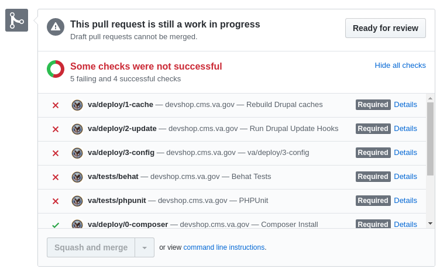

# Testing

The code for cms.VA.gov undergoes numerous tests before merging, and tests
are run before deployment and release.

The automated test suite for cms.VA.gov is defined in the [tests.yml](../tests.yml)
 file and is run using the [Yaml-Tasks](https://github.com/devshop-packages/yaml-tasks) tool, allowing the same command to be used local development, in CMS
 -CI and for production releases.

The *Yaml Tasks* Composer plugin is required by the main va.gov-cms
`composer.json` file.

## Goals

To adopt a strong test driven culture, the testing tools must:

1. Run the same tests in multiple environments with minimal configuration and
 a single command.
2. Allow developers to define tests to include in the suite and to write the
 tests.
3. Provide feedback to developers as quickly as possible and make test output as
 readable and accessible as possible.

## Scope

To avoid entanglement of tests, tests should adhere, when possible, to their own
area of concern. Practice separation of concerns as much as possible. There are
three areas of concern.

1. **CMS** - This is the functioning of being able to login, edit and publish
  content.  It's boundary of concern ends at the GraphQL endpoints.
2. **Front-end** - This is the Metalsmith build that creates the html front-end
  from the content accessed at the GraphQL endpoints of the CMS.
3. **Content** - This is the realm of making sure menu links and other links in
  content work.  508 testing is also part of content testing.

  Entanglement should be avoided because it causes people from the non-relevant
  team to spend time solving issues that are not in their area of concern.
  Example: *Developers chasing down a mis-entered content link is not a good use
  of time.*
  End to End tests should be achieved when possible, by each area of concern
  providing coverage for their particular area.

The **Yaml Tests** tool was designed with these goals in mind.

## VA.gov CMS Test Suite

Always refer to the file `tests.yml` for the canonical list of required tests
 that are included in the automated testing system, and are required to pass
 before merge or deployment,

There are 4 main types of tests:

1. **Static Tests:**
  Static tests are run as a Git Commit hook: Developers cannot commit code if
  any of these tests fail. Static tests only require the source code. No site
  is needed.

    See the [hooks/pre-commit file](../hooks/pre-commit) for the exact
  command run before git commit.
    1. `va/tests/phpcs` - "PHP CodeSniffer" tests ensure coding standards
     are met.
    1. `va/tests/phplint` - Ensures no syntax errors are present.
1. **Deployment Tests:** These commands are run during a production
 deployment. By treating them as tests, developers can identify failures in
  the deployment process before they go to production.
    1. `va/deploy/0-composer` - Composer Install.
    1. `va/deploy/1-cache` - Cache Rebuild.
    1. `va/deploy/2-update` - Database Update.
    1. `va/deploy/3-config` - Configuration Import.

    *NOTE: The tests are run in the order listed in `tests.yml`. The numbers
     here are to keep them in order when listed on GitHub.*
1. **WEB Integration Tests**
    1. `va/web/build` - Build the front-end from the current site. (Alias for
     `composer va:web:build`).
    1. `va/web/unit` - Run the front-end unit tests. (Not yet merged. See
     [PR547](https://github.com/department-of-veterans-affairs/va.gov-cms/pull/547))

    The long term goal is to run *all* of the **WEB** project's tests in our
     test
    suite, but more work is needed in the **WEB** codebase to make that
    possible.

1. **Functional Tests**
    1. `va/tests/phpunit` - The CMS PHPUnit Tests include a number
     of tests, including Creating Media, testing GraphQL, Performance tests
     , Security, and more. See the [tests/phpunit folder](tests/phpunit) to
      see all the PHPUnit tests.

      Utilizing the DrupalTestTraits library with PHPUnit gives developers the
      ability to bootstrap Drupal and write tests in PHP without an abstraction
      layer provided by Gherkin. PHPUnit is the preferred tool to write tests
      due to its speed of execution.

      Run the tests specific to VA

      ```
      lando phpunit
      ```

        Run a specific PHPUnit test with the "path" argument:
        The path can be to a specific test file, or a directory with tests.

        ```
        lando phpunit-run {Path-to-test}

        lando phpunit-run docroot/modules/contrib/config_split/tests/src/Kernel/ConfigSplitCliServiceTest.php
        ```

        Run a specific test:

        ```
        lando phpunit-run {Path-to-test} --filter {test-function-name}

       lando phpunit-run docroot/modules/contrib/config_split/tests/src/Kernel/ConfigSplitCliServiceTest.php --filter testGrayAndBlackListExport
        ```


        Run a group of PHPUnit tests:

        ```sh
        lando phpunit-run . --group security
        ```

    1. `va/tests/behat` - The Behat test suite includes:
        1. *Content-Edit-Web-Rebuild test:*

            This test is critical: it ensures the CMS does not break the WEB
             build.

             See [tests/behat/features/content.feature](../tests/behat/features/content.feature)

        1. *Permissons Test:*

            See [tests/behat/features/perms.feature](../tests/behat/features/perms.feature)

        1. *Drupal Spec Tests:* The DST tool enforces the desired structure of
         the Drupal site by generating Gherkin Feature files. See
         [tests/behat/drupal-spec-tool](../tests/behat/drupal-spec-tool/) folder
          for all of the tests and more information on managing the Drupal Spec
          Tool.

        Run a specific behat test with the `--name` or `--tags` options:

        ```
        lando behat --tags=dst
        ```
   
     1. `va/tests/behavioral` - The [Cypress](https://github.com/cypress-io/cypress) behavioral test suite includes end-to-end logged out tests.

        To run and debug cypress tests in a web UI, run the following commands from the project root on your local machine (not within lando):

        ```
        npm i && cd tests/behavioral && ../../node_modules/.bin/cypress open
        ```
        
        You will see a window with a list of tests. Just click on the name of any test to run it within a browser.

## Running Tests

The main way to run Yaml-task tests is the `./bin/yaml-tasks --tasks-file=tests.yml` command.

Run `./bin/yaml-tasks --help` for more information.

*NOTE: The `bin` directory is automatically included in the $PATH for all
 Composer commands, including yaml-tasks itself.*

  See [Composer Paths](#composer-configbinpath-and-path) for more information
   on Composer and $PATH.

### Local Testing with Lando: `lando test`

This project is configured to work with Lando out of the box.

Lando commands are listed in [`.lando.yml`](../.lando.yml). There are some
 helper commands that map to Composer Yaml-task commands.


 | Lando Command        | Composer Command
 |--------------        |----------------
 |lando test            | ./bin/yaml-tasks --tasks-file=tests.yml
 |lando test va/deploy  | ./bin/yaml-tasks --tasks-file=tests.yml va/deploy
 |lando web-build       | composer va:web:build
 |lando phpunit         | ./bin/yaml-tasks --tasks-file=tests.yml va/tests/phpunit
 |lando web-build       | composer va:web:build
 |lando behat           | cd /app/tests/behat && /app/bin/behat

*NOTES:*
  - Any arguments passed to the `lando` command are passed through to the
 composer command.
  - Any Composer command can be run inside a Lando container after you call
   `lando ssh`.

@TODO: Standardize this mapping on Yaml-tasks. It will continue to improve
 with features like timing, profiling, output logging, etc.

### Limit tests to run
You can add an argument to filter the tests to run:

 ```sh
 # Run the entire test suite.
 ./bin/yaml-tasks --tasks-file=tests.yml

 # Run `va/tests/phpunit` only
 ./bin/yaml-tests --tasks-file=tests.yml phpunit

 # Run all `va/deploy/*` tests.
 ./bin/yaml-tasks --tasks-file=tests.yml va/deploy
 ```


## GitHub Integration

The Yaml-Tasks tool also integrates with GitHub, providing pass/fail commit
 status for each test listed in `tests.yml`, and posting errors as comments
  on the commit's page on GitHub.com.

### Branch Enforcement Rules

All of the tests in `tests.yml` are required to pass before a Pull Request
 can be merged. This is enforced by GitHub.com and is configurable: See the
  [Branches section of the repository's Settings](https://github.com/department-of-veterans-affairs/va.gov-cms/settings/branches).


If an individual test fails, the Yaml-test tool creates a comment on the
 commit with the failed test results.
 The test results are also logged in DevShop.

### GitHub Statuses API

The API used by Yaml Tests and GitHub for testing code is called the
 "Statuses API": https://developer.github.com/v3/repos/statuses/

It stores test results attached to the commit, based on SHA.

Yaml-tasks reads the SHA of git repository, runs the test, and sends the state
to GitHub Status API, which sends it along to the users.

What you end up seeing is something like this:



*NOTE: The GitHub API stores this information attached to the Commit, not to
 the PR.*

 *This means
if you open a second PR with the same commits, the commit status AND the
 commit comments will show in *both* pull requests.*

 ### Composer, `config.bin-path`, and $PATH

 Composer automatically loads the directory `bin` into the PATH of any
  composer command or script. More accurately, it includes the directory set in
  the `config.bin-dir` section of `composer.json`.

  This means you only have to include the script name when referring to them in
  `composer.json` or in `tests.yml`.

 For example, if you wanted to create a `composer special-tests` command as
  an alias for `yaml-tasks` but with a different file and with a filter, add
   this to `composer.json`:

  ```json
  {
    "scripts": {
      "special-tests": [
        "which yaml-tasks",
        "yaml-tasks myuniquetests --file=custom.yml"
      ]
    }
  }
  ```

 Or, if you want to run `drush` or `npm` (or any other script in the `bin` dir) as a
  test, just call the script name:

  ```yaml
  # tasks.yml example that runs commands from the project's ./bin directory.
  example/drush/status: drush status
  example/drush/version: drush --version
  example/npm/which: which npm
  example/npm/version: npm --version
  ```

The `which npm` command helps you find out which file is actually being run.

In this project's case, `which npm` would print `/path/to/va.gov-cms/bin/npm`.


## Fortify security scans

Fortify scans are run manually.

About Drupal Security Team Coverage
When a module is covered by the Drupal Security Team it means that the team will receive reports of vulnerabilities from the Drupal community and the general public and will work with the maintainer to fix and coordinate the module and advisory release.

Symfony and other non-Drupal.org hosted libraries are all out of scope for the Drupal Security Team, though the security team will occasionally work with these projects security teams to coordinate releases or help test etc. Symfony has an active security team and process/advisories (see https://symfony.com/blog/category/security-advisories).

Composer libraries don't have any defined process nor advisories, therefore this scan offers of additional scrutiny.

Excluded directories
Drupal 8 core and contributed modules covered by the Drupal Security Team were not included in the scan.
```
  ./docroot/core/**/*"
  ./docroot/includes/**/*"
  ./docroot/modules/contrib/**/*"
  ./docroot/themes/contrib/**/*"
  ./docroot/profiles/**/*"
  ./docroot/scripts/**/*"
```
Included Vendor Libraries
Vender libraries are third party open source packages included by Drupal core and modules to add functionality. For example Drupal 8 includes the Symfony open source project which in turn may include libraries from other open source projects. Symfony has an active security team monitoring security and posting process/advisories (see https://symfony.com/blog/category/security-advisories).

Whether these third party libraries are secure involves multiple factors (and has no definitive answer) project lifetime, maintenance status, frequency/size of major changes, number of maintainers, skills of maintainers in security topics, security of the projects own dependencies, security surface area (does the project deal with user actions, data, sessions, external systems etc), security architecture and threat model, code quality, documentation etc.

## Nightwatch accessibility testing

Nightwatch is not currently included in the CMS test suite.

@TODO: Add Nightwatch tests using composer npm-asset and add to `tests.yml`

## Manual visual regression

@TODO: Document what this means.


## Test Coverage Map
[(edit)](https://www.draw.io/?lightbox=1&highlight=0000ff&edit=_blank&layers=1&nav=1#R7V1bd5s4EP41Pqd9SA9gg%2FGj4zqXTZx64yZp%2B9Ijg2zTYEQE%2BLK%2FfiUBDkZyLg0g37bnbGyJi%2Fx9o9HMaCTV6p3p4hwDf9JDNnRrmmIvavWvNU1TtWaT%2FKEly7jESAvG2LGTi54LBs5%2FMClUktLIsWGwdmGIkBs6%2FnqhhTwPWuFaGcAYzdcvGyF3%2Fa0%2BGEOuYGABly99cOxwEpeauvJcfgGd8SR9s6okNVOQXpwUBBNgo3mmqN6t1TsYoTD%2BNF10oEvBS3GJ7zvbULtqGIZe%2BJYburhr3f%2FRnnq48%2Fsi%2Btpu%2FTKvT4z4KTPgRskPvvRCiD1A7jRc8tzTISafxvRT8jPCZYoNRpFnQ%2Fp4hVTPJ04IBz6waO2cSAMpm4RTl3xTyccgxOgRdpCLMLu7rrD%2FSM0YA9shPyJTN2T%2FSN3Icd1M%2BUin%2F0j5DOLQISy1XWfskboQ0deNkBcOkvYJ8EmK6L1wkSlK8DqHaApDvCSXJLVmfEMiukR44%2B%2FzZ0FQtYYWF07WpKCZkA4S8Ruvnv3MEPmQkCQm7Crs9FrD6%2F6Pu%2BU%2F2gXuDn6e45MmR1h3sZmwt5QcGqmqZhhf9NeZrSuVEqtzxPaAF1FaP0JQDmpbh6bdEBFnasO6YZAaFwyh20eBEzqIkmBBqhAy7FznLpg6tk3bdgoS2rg7XuIzlcAPUdo0cnzqPJ%2BNppDPegF8zuzWcHHfMR4aY%2FPH9fzHldF2T0yhZiXdIiTckXu9EJE%2F%2FVvy8M4l%2BUSI0JR2FKJpfMVHWN8AfE4WADRHlkgWDMuEw5GAKkGnbkJgQKUYGlXzVRabdaG6LYJFv6e3vYb%2B8NtAk8fLuzBU%2Frs5UTkWew7lkIo%2Bp0s%2F3UYeNXUi7HhjagKkl35%2Bg959hdIi4K3n8DVNXuuZAnzNstDVOHTPIs%2BiiImGM9pXFHaZ8pOvZZ1oY%2B174QaBH1uTI2dBe10R%2BNfrrVfxNwVKqjT46xz8fYhHCE%2BBR2DZO%2Fwbjdflv1L8Gxz%2Bp8B6JCXQo0NEpzcoAcjsKOAhD3IDQFJYuC3dXB%2Bj6y1FLvq8wZWi7WOYN5gpGmu4G08RSitOAua2tskFquYvniupwxkT81x2Ad0ZpKNz9rKkCyHXBX7gDN1V7yO%2FLH71enNIsaCRm9v9tla8%2F%2BfFL%2FOBx7z%2BnWr0ND%2BOv7HVBXa%2FtxnkBfQ9LTfyN5qtyvreZbc7btnfHnqP44vrmeK36igUmFXbMECkkZrl%2BteseaQKnYiyYHqffdTGELxhwCBghC958an%2B58eJVx28lSsoIm%2FdgymALn2drgZPV0PAllYWWfxozkH%2FEdd9ZFrQErprq5hL8V3ArL%2BtCzTKApWPTxYL6mikVQ6qqslGlQ8iForq5kGtTFQN2ajyEZ8bGuL5DgNqzXQQ%2BWl0smE79TEz9%2BPZF7WocE5OQbcEBClVaugWR9CAPPnIDf1el01O2lUz7JwjZB%2FZod%2Bb0tnhLXZOryk9gs7GKac3e9CKyFu7hmMWFNngqlUnGHEo%2FY1SUeSsVeN150QTSIRegEQIwyciG2KjR%2F9RJz%2B%2B9QICN5xYAMsJj3wsbrC%2F0QTdqC6aIBRFflwvlvJrx3sMyD2uwzTeDggfr373QfDyE1jSBU8wKnaQN3LG0aYpwswcSv%2FFORRB7YdJK6Lvb9kUisqHyIrtcW3bxjCgvX%2FkQNeW2%2F0tNPWJncJeenjdPyd7ZkOVLHuiiF%2BhsucSbI4StzUS10qTT6RJnCgcWiTd3YUPPBuwCUiFeVFH0dsK0VMVTbbs8eHNYvnuQS9iRjYzto%2BUq6rKR30qpVzjQ3J3AcSUJDR2BNbtYPDN2U3s87lBddmGrSZwLTAEIVXMHrL5YOhOwlxlIoIYZt5%2F6NpOuFcgS3eTNT7R8Iahq8AYa5pzuJtY57PaqsT66%2BLX3dhHZz9nne8j47%2BJ%2BftSE6SMlGghSrQOJRunh5Q9lg%2B7GUZ1mZtCGS%2FbEl2P9x5lTIKMNXXJMiaYjl63fXcR5fwKhCqtXDHKe2nl5mGu0soVw7yHVm4eZOmWlypYThMNyRgy2Sucm3p1YXcxznzY%2FQHhxyH0LIo0hoGPvMCZQY%2FN2%2Bwi5nkPTrrFpQpXJ8dZPxYxSViUVrGdwHfBcjcxz3tyhiFbzvlg%2F%2B5bIHmUG03ZFsi78pj%2BwopPOMPIhcewdo1lqVUX1hZTXrb%2F2Id46gQB8dwOk3Fdz0V5TcmqVBBML5bxf9t%2FGw0LfODVRGmxjOmTIKaaPj6%2BOfdiYFkI2%2BsxgviRuyxA%2BQxD6faPVnZYVZoABdYETsFeS4%2F0WJJg%2FmNPpCfyCJORFUaYblmzxzJUZbKZWIbKTjbrx97cIQWd8yRLD4dqf7MnxbtmNoBns72JpE1q%2BIcnZvm5DfliVnYa4U00HTKv1wKsNSg6zqPJkTX541bZ8ZVbCKww%2FoFjeBQzOSNnqy5bzMqO6RBGvHgqJ4imU0CbfJQ0CQpNuqTVy44lfYtCTHTa5ChgUgRM%2BmR9usikPE8Poyk6SpcU6ap0HYdYvMoORg0i30ds3VoA8cx53kn0KGqV2mSVitri9506vJg6v8%2B7N535yaWuXt4JdvkbQCvCTrgynoreJuTTJY1mAtuONyenZ0XEocsTF0RxfkiwaoKC4cyBc%2BHmzEJp2fUNcPPzclWu3hYKCD%2FStS0rXm0N7Omu5jjkYa4yk0QIM6%2FxV0mWIMF7H3DWm9XhfHI96g8ezJPh05%2BvZ8qT3jHGT8JdTYsczc7oDgSvpRTsxVCWTxlpNeQyy%2FegTMrhLiKcz%2Bo0G2p6JoosjPm5D3ak1L%2FX%2FGAKPdtHzvPK8JK2R5emyZp6dSlSQi74CYJPCRkCa8mP7ShmaKHdHU7ySbdVJjoLSSh7W6vOKnF3Gh%2FbdmjjSpXJp2KDgV9kVCzFqTktzQGnyeEYHaBsVTnJK5atsuM890TnH6AxaujVxYfFxJadCdSDtgMOj9gqF5CJiS07%2B4f6LCMXzQ%2BP2ypTQMXc8hZ10s2KRXfzgQa2MTT0wrxHiaFmMb58msl3sEAemha%2BHE0OxFXuPSc8z1LjAL5GwN7OQHczt8pMq%2FCsMSF4%2B7sBTh7qKtf6CKHmraN9W6mah1xvSlYNvN2y%2BwtV8yBXeVyhEGTegEhUiJ9uMrAPMBuGZFnm7QgW%2BHwSnLc2WFs6tesx6PyMQJVr7oRMlL619%2B3BLsnOzzdUGaw6NbVW7%2FTqUVeGXThf3sxO9KHAPloRkE2%2BiE9KT89RjzM8BiEII5oxcAWzObnD15m0nVlNlGlCt5Y7SQ6CoakmLhyFvPSkT8mudftZSzNA1ttItzJ2YZjNhFpfIrcqZm0qu5n9TDNrmVmbrWjczapxN4j2aCdB8oUFhuIG5jrmdhwWVYSi1pQv64Pm6uCf7GFAaTQr23%2FTI%2FI%2B0n%2Bvwk6vNbzu%2F7hb%2FqNd4O7g5zkWZD7crrbh2U4XsWXkXMQKVaAQQn6025ws99AetAMRru%2FrlIlAv9It%2FzYXr6af3tPaznIIcSbr7psPY8VIlXYnaYLyqTP41vlMPtxHrkcuGDpufPnAAp7H1iwq3yGY0kvvB98%2F1%2FSvH9MHEmROJdKT67qawMpSFY2Xu1Vh4YLHj73nkDLANK4ywrFhFR9J%2F6kHQ%2BAGUyekqZQhJMMauS74vJtmUF4HVGkGCangFzFlqaBLZ1lqJJvUddIesh%2FuR35jqCqzL4Rc8NkX1KbD7OTtDu0Qi%2Bw34FkTxEIe2eMLdp0UVW3kt%2Buqbo5MbGjw4b0%2B9cbO%2BoidzXadpnkPpgSWWnz6bhl8lIGudBtEMEvFtrC0uIHgNR2kn7bpZRfIygzUu94dDL3%2BRV60W8wYH69qlzw8FKLslS0TfH7kPcvKO5fymPSKUuU6cT%2FFbmrBx8vyol1pTChw1PPG4sp0Gr0f%2FUHvp3%2FVfSGb%2FmNBhy5bW6sMEfFZFAx9DAOCGzOsmE3LxhFILFzml9D5C6V%2F0b%2Fz6EQdHepP4QQkHz0KwxyE9IFn4AdMLIPQ%2BvI88ighu1wBGMYkhQ5wXQq9RU9OZpbdcMlMCJS8E%2Fg%2BBPTDksCE5uRhBphSyfGGAf3zfUIfNUaAYcjeQZc5TcCMLelg0I4xhB53ZxXBHGHItPC3nTFrK0wwnhO6GFMhg2ZIRYZBDmJKnPVw3KsO7ls9ZeRGU%2BbHxuxOAX5khK6vFFNYW9fXh9H%2Bwpq7XN2djXTRLyh9EGBDLruf7m5MNIYzg%2B6SClnveYHjCoz4aeyXwYUF%2FaQ6cDwL5t%2BJIy9tS2atpIIs4q4H9AXdheVGyVaWBOZ4OxdaW2Oz1pnXJnIeRF4Aw4QT2sL7%2FuonpAKOoQtBAOkLtjSk99ZjvgtQvXw8TxDOM9PZmazqbeklqV4%2BFvVC%2Bv8wclzREFnOWoBqsm%2FyawHMhiZ3MOSDNJujg514Xvg2WZWxjQagIBJWbxocxOVFwrq4a93%2F0Z56uPP7Ivrabv0yrwUWxwbvZ%2BYEERt8MVHYkO30eyg%2BkKrohjQXSMgar6w2sPbvyhqK%2F9%2FeI07kJasIOeHV1X3aZW5f6jLboJryYFaZPCgEUxDyOjQBz0fKpAs4n%2FLW6Q1IwVnkWencVmzz9nFZ4%2FB2UFHlqnshFe%2BOgH26jRg%2FzNNh1uvnZ7Zut0EH8dGYEiNkNRrqol7tqo7Z%2Bj22JrTe%2FR8%3D)
<iframe frameborder="0" style="width:100%;height:1399px;" src="https://www.draw.io/?lightbox=1&highlight=0000ff&edit=_blank&layers=1&nav=1#R7V1bd5s4EP41Pqd9SA9gg%2FGj4zqXTZx64yZp%2B9Ijg2zTYEQE%2BLK%2FfiUBDkZyLg0g37bnbGyJi%2Fx9o9HMaCTV6p3p4hwDf9JDNnRrmmIvavWvNU1TtWaT%2FKEly7jESAvG2LGTi54LBs5%2FMClUktLIsWGwdmGIkBs6%2FnqhhTwPWuFaGcAYzdcvGyF3%2Fa0%2BGEOuYGABly99cOxwEpeauvJcfgGd8SR9s6okNVOQXpwUBBNgo3mmqN6t1TsYoTD%2BNF10oEvBS3GJ7zvbULtqGIZe%2BJYburhr3f%2FRnnq48%2Fsi%2Btpu%2FTKvT4z4KTPgRskPvvRCiD1A7jRc8tzTISafxvRT8jPCZYoNRpFnQ%2Fp4hVTPJ04IBz6waO2cSAMpm4RTl3xTyccgxOgRdpCLMLu7rrD%2FSM0YA9shPyJTN2T%2FSN3Icd1M%2BUin%2F0j5DOLQISy1XWfskboQ0deNkBcOkvYJ8EmK6L1wkSlK8DqHaApDvCSXJLVmfEMiukR44%2B%2FzZ0FQtYYWF07WpKCZkA4S8Ruvnv3MEPmQkCQm7Crs9FrD6%2F6Pu%2BU%2F2gXuDn6e45MmR1h3sZmwt5QcGqmqZhhf9NeZrSuVEqtzxPaAF1FaP0JQDmpbh6bdEBFnasO6YZAaFwyh20eBEzqIkmBBqhAy7FznLpg6tk3bdgoS2rg7XuIzlcAPUdo0cnzqPJ%2BNppDPegF8zuzWcHHfMR4aY%2FPH9fzHldF2T0yhZiXdIiTckXu9EJE%2F%2FVvy8M4l%2BUSI0JR2FKJpfMVHWN8AfE4WADRHlkgWDMuEw5GAKkGnbkJgQKUYGlXzVRabdaG6LYJFv6e3vYb%2B8NtAk8fLuzBU%2Frs5UTkWew7lkIo%2Bp0s%2F3UYeNXUi7HhjagKkl35%2Bg959hdIi4K3n8DVNXuuZAnzNstDVOHTPIs%2BiiImGM9pXFHaZ8pOvZZ1oY%2B174QaBH1uTI2dBe10R%2BNfrrVfxNwVKqjT46xz8fYhHCE%2BBR2DZO%2Fwbjdflv1L8Gxz%2Bp8B6JCXQo0NEpzcoAcjsKOAhD3IDQFJYuC3dXB%2Bj6y1FLvq8wZWi7WOYN5gpGmu4G08RSitOAua2tskFquYvniupwxkT81x2Ad0ZpKNz9rKkCyHXBX7gDN1V7yO%2FLH71enNIsaCRm9v9tla8%2F%2BfFL%2FOBx7z%2BnWr0ND%2BOv7HVBXa%2FtxnkBfQ9LTfyN5qtyvreZbc7btnfHnqP44vrmeK36igUmFXbMECkkZrl%2BteseaQKnYiyYHqffdTGELxhwCBghC958an%2B58eJVx28lSsoIm%2FdgymALn2drgZPV0PAllYWWfxozkH%2FEdd9ZFrQErprq5hL8V3ArL%2BtCzTKApWPTxYL6mikVQ6qqslGlQ8iForq5kGtTFQN2ajyEZ8bGuL5DgNqzXQQ%2BWl0smE79TEz9%2BPZF7WocE5OQbcEBClVaugWR9CAPPnIDf1el01O2lUz7JwjZB%2FZod%2Bb0tnhLXZOryk9gs7GKac3e9CKyFu7hmMWFNngqlUnGHEo%2FY1SUeSsVeN150QTSIRegEQIwyciG2KjR%2F9RJz%2B%2B9QICN5xYAMsJj3wsbrC%2F0QTdqC6aIBRFflwvlvJrx3sMyD2uwzTeDggfr373QfDyE1jSBU8wKnaQN3LG0aYpwswcSv%2FFORRB7YdJK6Lvb9kUisqHyIrtcW3bxjCgvX%2FkQNeW2%2F0tNPWJncJeenjdPyd7ZkOVLHuiiF%2BhsucSbI4StzUS10qTT6RJnCgcWiTd3YUPPBuwCUiFeVFH0dsK0VMVTbbs8eHNYvnuQS9iRjYzto%2BUq6rKR30qpVzjQ3J3AcSUJDR2BNbtYPDN2U3s87lBddmGrSZwLTAEIVXMHrL5YOhOwlxlIoIYZt5%2F6NpOuFcgS3eTNT7R8Iahq8AYa5pzuJtY57PaqsT66%2BLX3dhHZz9nne8j47%2BJ%2BftSE6SMlGghSrQOJRunh5Q9lg%2B7GUZ1mZtCGS%2FbEl2P9x5lTIKMNXXJMiaYjl63fXcR5fwKhCqtXDHKe2nl5mGu0soVw7yHVm4eZOmWlypYThMNyRgy2Sucm3p1YXcxznzY%2FQHhxyH0LIo0hoGPvMCZQY%2FN2%2Bwi5nkPTrrFpQpXJ8dZPxYxSViUVrGdwHfBcjcxz3tyhiFbzvlg%2F%2B5bIHmUG03ZFsi78pj%2BwopPOMPIhcewdo1lqVUX1hZTXrb%2F2Id46gQB8dwOk3Fdz0V5TcmqVBBML5bxf9t%2FGw0LfODVRGmxjOmTIKaaPj6%2BOfdiYFkI2%2BsxgviRuyxA%2BQxD6faPVnZYVZoABdYETsFeS4%2F0WJJg%2FmNPpCfyCJORFUaYblmzxzJUZbKZWIbKTjbrx97cIQWd8yRLD4dqf7MnxbtmNoBns72JpE1q%2BIcnZvm5DfliVnYa4U00HTKv1wKsNSg6zqPJkTX541bZ8ZVbCKww%2FoFjeBQzOSNnqy5bzMqO6RBGvHgqJ4imU0CbfJQ0CQpNuqTVy44lfYtCTHTa5ChgUgRM%2BmR9usikPE8Poyk6SpcU6ap0HYdYvMoORg0i30ds3VoA8cx53kn0KGqV2mSVitri9506vJg6v8%2B7N535yaWuXt4JdvkbQCvCTrgynoreJuTTJY1mAtuONyenZ0XEocsTF0RxfkiwaoKC4cyBc%2BHmzEJp2fUNcPPzclWu3hYKCD%2FStS0rXm0N7Omu5jjkYa4yk0QIM6%2FxV0mWIMF7H3DWm9XhfHI96g8ezJPh05%2BvZ8qT3jHGT8JdTYsczc7oDgSvpRTsxVCWTxlpNeQyy%2FegTMrhLiKcz%2Bo0G2p6JoosjPm5D3ak1L%2FX%2FGAKPdtHzvPK8JK2R5emyZp6dSlSQi74CYJPCRkCa8mP7ShmaKHdHU7ySbdVJjoLSSh7W6vOKnF3Gh%2FbdmjjSpXJp2KDgV9kVCzFqTktzQGnyeEYHaBsVTnJK5atsuM890TnH6AxaujVxYfFxJadCdSDtgMOj9gqF5CJiS07%2B4f6LCMXzQ%2BP2ypTQMXc8hZ10s2KRXfzgQa2MTT0wrxHiaFmMb58msl3sEAemha%2BHE0OxFXuPSc8z1LjAL5GwN7OQHczt8pMq%2FCsMSF4%2B7sBTh7qKtf6CKHmraN9W6mah1xvSlYNvN2y%2BwtV8yBXeVyhEGTegEhUiJ9uMrAPMBuGZFnm7QgW%2BHwSnLc2WFs6tesx6PyMQJVr7oRMlL619%2B3BLsnOzzdUGaw6NbVW7%2FTqUVeGXThf3sxO9KHAPloRkE2%2BiE9KT89RjzM8BiEII5oxcAWzObnD15m0nVlNlGlCt5Y7SQ6CoakmLhyFvPSkT8mudftZSzNA1ttItzJ2YZjNhFpfIrcqZm0qu5n9TDNrmVmbrWjczapxN4j2aCdB8oUFhuIG5jrmdhwWVYSi1pQv64Pm6uCf7GFAaTQr23%2FTI%2FI%2B0n%2Bvwk6vNbzu%2F7hb%2FqNd4O7g5zkWZD7crrbh2U4XsWXkXMQKVaAQQn6025ws99AetAMRru%2FrlIlAv9It%2FzYXr6af3tPaznIIcSbr7psPY8VIlXYnaYLyqTP41vlMPtxHrkcuGDpufPnAAp7H1iwq3yGY0kvvB98%2F1%2FSvH9MHEmROJdKT67qawMpSFY2Xu1Vh4YLHj73nkDLANK4ywrFhFR9J%2F6kHQ%2BAGUyekqZQhJMMauS74vJtmUF4HVGkGCangFzFlqaBLZ1lqJJvUddIesh%2FuR35jqCqzL4Rc8NkX1KbD7OTtDu0Qi%2Bw34FkTxEIe2eMLdp0UVW3kt%2Buqbo5MbGjw4b0%2B9cbO%2BoidzXadpnkPpgSWWnz6bhl8lIGudBtEMEvFtrC0uIHgNR2kn7bpZRfIygzUu94dDL3%2BRV60W8wYH69qlzw8FKLslS0TfH7kPcvKO5fymPSKUuU6cT%2FFbmrBx8vyol1pTChw1PPG4sp0Gr0f%2FUHvp3%2FVfSGb%2FmNBhy5bW6sMEfFZFAx9DAOCGzOsmE3LxhFILFzml9D5C6V%2F0b%2Fz6EQdHepP4QQkHz0KwxyE9IFn4AdMLIPQ%2BvI88ighu1wBGMYkhQ5wXQq9RU9OZpbdcMlMCJS8E%2Fg%2BBPTDksCE5uRhBphSyfGGAf3zfUIfNUaAYcjeQZc5TcCMLelg0I4xhB53ZxXBHGHItPC3nTFrK0wwnhO6GFMhg2ZIRYZBDmJKnPVw3KsO7ls9ZeRGU%2BbHxuxOAX5khK6vFFNYW9fXh9H%2Bwpq7XN2djXTRLyh9EGBDLruf7m5MNIYzg%2B6SClnveYHjCoz4aeyXwYUF%2FaQ6cDwL5t%2BJIy9tS2atpIIs4q4H9AXdheVGyVaWBOZ4OxdaW2Oz1pnXJnIeRF4Aw4QT2sL7%2FuonpAKOoQtBAOkLtjSk99ZjvgtQvXw8TxDOM9PZmazqbeklqV4%2BFvVC%2Bv8wclzREFnOWoBqsm%2FyawHMhiZ3MOSDNJujg514Xvg2WZWxjQagIBJWbxocxOVFwrq4a93%2F0Z56uPP7Ivrabv0yrwUWxwbvZ%2BYEERt8MVHYkO30eyg%2BkKrohjQXSMgar6w2sPbvyhqK%2F9%2FeI07kJasIOeHV1X3aZW5f6jLboJryYFaZPCgEUxDyOjQBz0fKpAs4n%2FLW6Q1IwVnkWencVmzz9nFZ4%2FB2UFHlqnshFe%2BOgH26jRg%2FzNNh1uvnZ7Zut0EH8dGYEiNkNRrqol7tqo7Z%2Bj22JrTe%2FR8%3D"></iframe>

[Table of Contents](../README.md)
