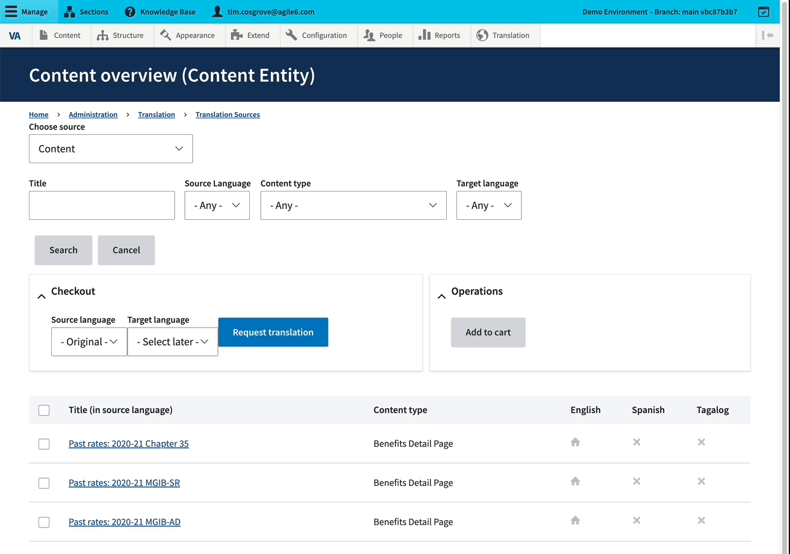
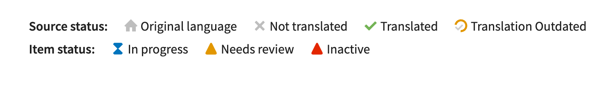
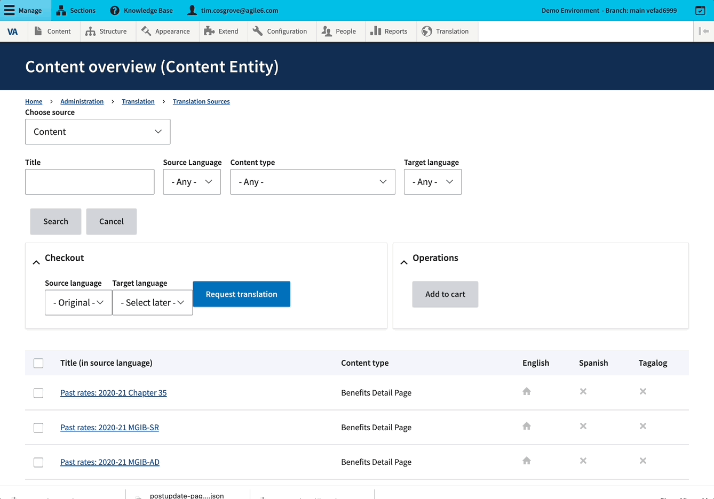
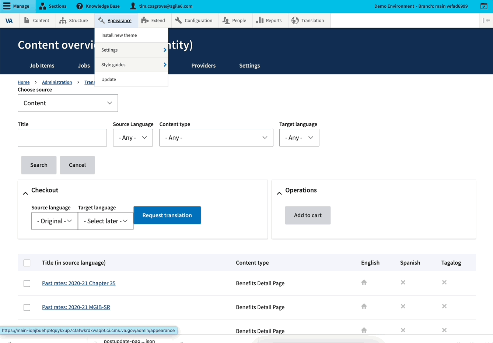
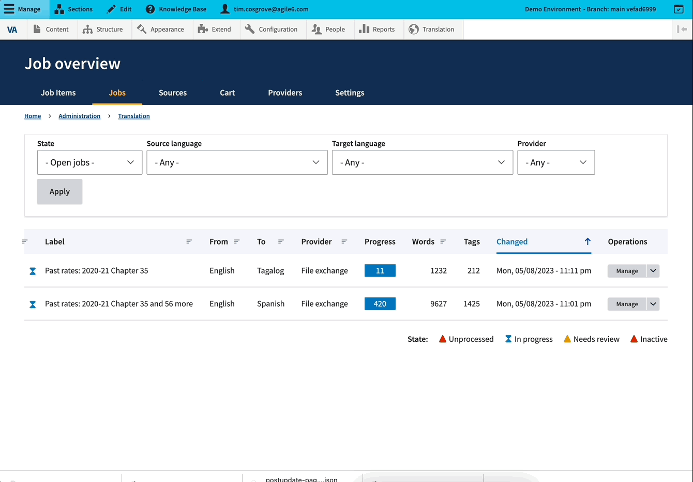

# Translation management
This document outlines how to select content for translation, send it to translation specialists, import the results, and review and manage the imported translations. This set of processes is collectively called "translation management".

In the translation management system, content that can be submitted for translation is called a "source". Multiple pieces of content can be grouped together for translation. A collection of content that is grouped together for translation is called a "job".

The process consists of these steps:

1. [Selecting content sources for translation](#selecting-content)
2. [Creating a translation job](#creating-job)
3. [Downloading the job file](#downloading-file)
4. [Handing off the job files and receiving them](#file-transfer)
5. [Importing the job file](#file-import)
6. [Reviewing the translations](#translation-review)
7. [Finalizing translations](#finalizing-translations)

Translation management can be performed by users with either the 'Translation manager' or 'Content admin' roles.

## <a name="selecting-content">Selecting content sources for translation</a>

---

<figure>

<figcaption><strong>The Sources overview page</strong></figcaption>
</figure>

---
The [Sources](https://prod.cms.va.gov/admin/tmgmt/sources) page provides an overview of all content in the CMS that is translatable and its translation state. The page defaults to listing nodes, but anything that can be translated can be listed here.

---

<figure>

<figcaption><strong>Using the source filters to select other kinds of content.</strong></figcaption>
</figure>

 ---

In this overview, we can see:

* At top, a number of filters and search fields for limiting what content is displayed in the Sources list
* Buttons for 'Request translation' and ‘Add to cart’ functionality, to start the translation process for selected pieces of content.
* The listing of content itself.

There are a number of icons giving information about each piece of content. This allows you to see what content has been translated into which languages, and also if a content item is currently in the process of translation.

This image shows the possible statuses a content item can have:

---

<figure>

<figcaption><strong>Various statuses content can have.</strong></figcaption>
</figure>

---

The process of selecting content for translation uses a shopping metaphor. You can select the items you want to translate from the Sources page, and either "check out" immediately, or "add to cart", collecting items for translation a few at a time.

In order to translate content, select the checkbox(es) for that content. You can submit the selected content immediately to a job by using the 'Request translation' button:

---

<figure>

<figcaption><strong>Selecting content and using 'Request translation'.</strong></figcaption>
</figure>

---

You can also select content and use 'Add to cart' to mark it for translation. You can then search for different content, add that to your cart as well, and then submit the entire cart to job creation.

---

<figure>

<figcaption><strong>Selecting content with 'Add to cart'.</strong></figcaption>
</figure>

---

## <a name="creating-job">Creating a translation job</a>
<figure>

<figcaption><strong>The job creation page</strong></figcaption>
</figure>

---

Once you have selected content sources for translation, you are taken to the job creation page. This is where you will finalize your job, add any last minute items, and save it.

All jobs have a descriptive label. Adding your own label is optional but recommended. If you do not add a label, the job will create one for you, typically out of the title of one of the content items, for example "How to Claim Your Disability Benefits and 56 more".

Make sure that you have selected a target language. Each job can only target one language.

Your job may add items to ‘Suggestions’. These are content items that are attached to one or more of the pieces of content you have included here - these might be menu items, taxonomy terms, etc. If items are added here, it is a good idea to add them to your job. Once you add any suggestions, the job may offer additional suggestions. You can continue to add these; eventually they all will be submitted.

The 'provider' is the method by which the translation will happen. On the VA CMS, we only use the 'File exchange' method, and there are no options to be configured. You can ignore this section.

Once you are satisfied with your job, you can select "Submit to provider", which will set up the job. "Save job" is a way to save a job during the creation process without setting it up, but it will not allow the job to be translated.

## <a name="downloading-file">Downloading the translation job file</a>

Once you’ve set up your job by clicking 'Submit to provider', there will be message that you can download the file with your translation data:

---

<figure>

<figcaption><strong>Downloading a translation job file.</strong></figcaption>
</figure>

---

Right-click on the link and select ‘Save as…’. This file will be what gets sent to translation.

You can rename the file if it helps you keep organized. We do recommend keeping “JobID24” for example, to help you associate the file with its job.

It is recommended to download the file at this stage. If you do not, or you need to retrieve the file later, you can do this by clicking 'Manage' for the job in question, scrolling down to the messages at the bottom of the screen, and finding the message with the link and downloading it from there.

## <a name="file-transfer">Handing off the job files and receiving them</a>

Translation will be handled by translators at other government agencies. As such, the files that have been downloaded from the previous steps can be delivered to the other government agencies via any method (i.e. email).

When the translators have completed their translations, they will send the files back with the translations added to them. If the translators have renamed the files from the filename that was sent to them originally, that is fine. As long as you are able to associate the file with the appropriate job in the CMS, you will be able to use it.

It should be noted that with our setup, the people doing the actual translations at other agencies will never see the CMS translation management interface.

## <a name="file-import">Importing the job file</a>

All jobs can be seen at the [job overview page](https://prod.cms.va.gov/admin/tmgmt/jobs).

---

<figure>

<figcaption><strong>The jobs overview page.</strong></figcaption>
</figure>

---

You can see each job with its label, the source and target languages, the job progress, and numbers of words and HTML tags. The job shows a general status on the left, generally a blue hourglass for "in progress" or a yellow caution sign for 'needs review'.

A job that has not imported a file will have a progress meter that show blue. A job that has had its file imported will show some combination of yellow and green, depending on how much of the content has been reviewed. The progress numbers are by segments, or fields. The title of a page is a segment; a text field in a paragraph is a segment.

To import the file for a given job, click on ‘Manage’ for that job. You will see the job overview. This shows each content item and its status. To import a file, scroll further down the page, select it via the file upload widget, and click import. Once you do this, each job item can be reviewed.

---

<figure>

<figcaption><strong>Importing a file to a job.</strong></figcaption>
</figure>

---

## <a name="translation-review">Reviewing the translations</a>
Once the completed file for a translation job is imported, the content items in the job can be reviewed. Each content item will be reviewed individually. To review these items, click 'Manage' for that job, and then 'Review' for a given content item on the subsequent page.

---

<figure>

<figcaption><strong>Going into review for a content translation.</strong></figcaption>
</figure>

---

This is an opportunity for a language expert to review the translation to ensure it is correct. It is possible to make changes here, if desired. Click the checkmark on the right if the translation is satisfactory.

---

<figure>

<figcaption><strong>Reviewing and accepting an individual translation.</strong></figcaption>
</figure>

---

Once all translations have been reviewed, you can accept them, at the bottom of the form:

---

<figure>

<figcaption><strong>Accepting the translation.</strong></figcaption>
</figure>

---

Note that the interface will show you the current moderation state of the source content - draft, published, etc - and allow you to decide what moderation state the translation should be in. You also have the option to 'Validate' the translation (this will mainly check for empty fields) and to specifically 'Validate the HTML tags' in the translation.

If you are midway through a review, you can 'Save it and return to it later.

When you are satisfied with the translation, save it as completed. This will create the translation node.

## <a name="finalizing-translations">Finalizing translations</a>

You will sometimes need to edit translations after they have been imported. This can be done from the main content page.

Take this example page:

---

<figure>

<figcaption><strong>A content page with a 'Translate' tab.</strong></figcaption>
</figure>

---

In addition to options for View, Edit, etc, there is a tab ‘Translate’. The Translate tab is always available on content that is allowed to translated. It is possible to do translation completely via this tab, as well make updates to existing translations, but the process will be manual and have no connection to the translation management system.

Click on the Translate tab to get an overview of translations for this content.

---

<figure>

<figcaption><strong>The translations overview for an individual piece of content.</strong></figcaption>
</figure>

---

Here you can see each translation, and edit it if you choose.
