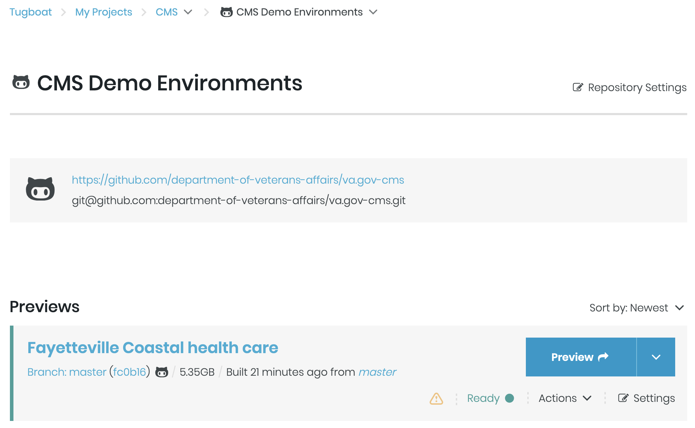
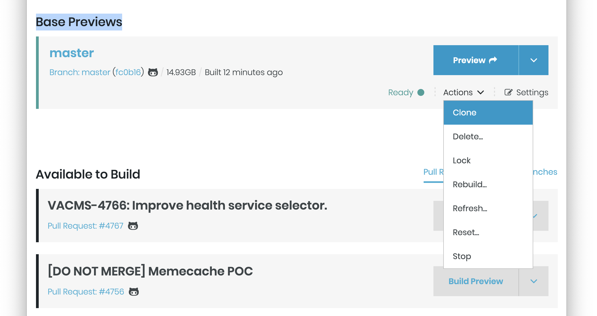
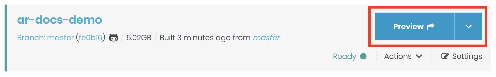
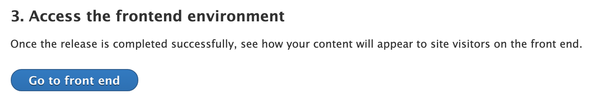

# Tugboat

**Note:** CI environments (Tugboat) are intended for automated testing, PR previews, and stakeholder demonstrations. For active development work, use a [local CMS environment](local.md) instead.

Tugboat is a development server platform where you can preview CMS code changes pre-production.

In order to access the Tugboat UI, you must have VA network access (via PIV card, CAG, or AVD).

## Tugboat Environments

Tugboat provides a complete SDLC pipeline for Drupal code:

- Creates new environments when a PR is open.
- Automatically tests the environment and passes status to GitHub to allow or block merging.
- Destroys and rebuilds PR Environments and runs the full test suite again on every git push.
- If the PR is merged or closed, environment is destroyed.
- Notifies GitHub of deployment success or failure, with links to the environments.

## Accessing Tugboat

1. Visit [https://tugboat.vfs.va.gov/](https://tugboat.vfs.va.gov/) (VA network access required)
2. Click on the "GitHub" link to log in with GitHub.

## Creating Demo Environments

Demo environments can be created for demonstrations or training purposes.

### Step-by-step Instructions

1. Visit [https://tugboat.vfs.va.gov/](https://tugboat.vfs.va.gov/) and click on the "GitHub" link to log in with GitHub.

   

2. Click the CMS link and then click the "CMS Demo Environments" to visit the Demos page.

   

3. Scroll down to the "Base Previews" heading and select "Clone" from the "Actions" menu.

   

4. Your demo environment has been created. It will be titled "master". Scroll to the top of the page, click on the "Settings" link for your new environment, and give it a title starting with your initials and a hyphen. Then, click the "Save Configuration" button.

   

5. If you wish to copy [prod.cms.va.gov](http://prod.cms.va.gov) using the latest content, do not change any additional options.

6. Click the "Preview" button for your environment to visit it.

   

**NOTE:** The WEB site for this environment will not work until you trigger a WEB Build process on the "Release Content" page.

## WEB Build Process

Within each environment, the static HTML for the _WEB_ site is occasionally "rebuilt" so that the latest content from that environment's _CMS_ is used.

The _WEB_ build process is tested in the CI system to ensure compatibility with the CMS content schema.

The _WEB_ build process is triggered automatically by certain actions in the CMS or manually via the command line.

### Build Triggers

The _WEB_ instance of an environment is rebuilt when any of the following actions take place in the _CMS_:

- Facility Alert or Individual Facility Operating Status is created or updated.
- The "Rebuild WEB" button is pressed.

## Rebuilding Environments Manually

There is a special button and form for rebuilding VA.gov environments. Use this to manually trigger either a WEB or CMS rebuild (or both), and optionally check out different code.

### Step-by-step Instructions

1. Find the environment you would like to build in Tugboat, and go to the preview.
2. Hover over the "Content" admin menu, and then click "Release Content".

   

3. If you wish to just trigger a WEB rebuild with the existing content, do not change any other options.

   

   **For advanced users and developers:**

   1. If you wish to change the branch of the WEB project, click "Select a different frontend branch/pull request". Start typing to search by the name of the branch or pull request you wish to use.

   

4. Press the "Release content" button. You will see the status of your build under the "Wait for the release to complete" heading. You may view the build logs by clicking the "View logs" link.

   

5. Once the REBUILD process is complete, you can click the "Go to front end" button under the "Access the frontend environment" heading.

   

6. That's it! If the process completed, you should see a site that looks like VA.gov.

## Testing Next Build and Content Build

Tugboat can be used to preview changes being made in Next Build and Content Build. This can be useful if you need to check Next Build or Content Build changes together with new CMS code, or if you want to create custom content to test features of the frontend code that VA.gov content doesn't test or demonstrate well.

To create your Tugboat instance, do one of the following:

1. When **testing changed CMS code**, simply create a PR with your working branch. If your CMS code changes are not yet ready for review, create a draft PR. This will still create a Tugboat instance.
2. When **testing frontend changes with no CMS code changes**, please create a Demo CMS Tugboat instance and do your frontend testing there. You should delete this demo instance once you are finished testing.

### Testing Next Build

Next Build is available on CMS Tugboat at the Tugboat domain with `next-` in it, for example https://next-medc0xjkxm4jmpzxl3tfbcs7qcddsivh.ci.cms.va.gov/. By default this uses the default next-build and vets-website branches.

This can be changed via the form at `/admin/content/deploy/next`. At that URL, you will see a simple form that allows you to rebuild the frontend with the option of choosing a different branch for either next-build or vets-website. Choosing 'Select a different next-build branch/pull request' will reveal a text field. Entering a search term in that text field will reveal both branches and PRs that match that search term.

Once you've chosen the branches you want to test with, hit 'Restart Next Build Server'. You will see status information about the build at the bottom of the page. You may need to refresh the page for this information to fill in. The Log File will be the best way to observe the progress of the build.

Rebuilding the Next Build Server generally takes about 5 minutes. Once complete, you can view the restarted server at the standard Next Build URL.

### Testing Content Build

Content Build is available on CMS Tugboat at the Tugboat domain with `web-` in it, for example https://web-medc0xjkxm4jmpzxl3tfbcs7qcddsivh.ci.cms.va.gov/. By default this uses the default content-build and vets-website branches.

This can be changed via the form at `/admin/content/deploy`. At that URL, you will see a simple form that allows you to rebuild the frontend with the option of choosing a different branch for either content-build or vets-website. Choosing 'Select a different content-build branch/pull request' will reveal a text field. Entering a search term in that text field will reveal both branches and PRs that match that search term, similarly to the Next Build form described above.

Once you've chosen the branches you want to test with, hit 'Release Content'. You will see status information about the build at the bottom of the page. You may need to refresh the page for this information to fill in. The Log File will be the best way to observe the progress of the build.

Rebuilding the Content Build static content generally takes about 60 minutes. Once complete, you can view the restarted server at the standard Content Build URL.

## SSH Access to CI Environments

To access a CI environment via ssh, go to that environment's page on Tugboat and click the "Terminal" link on the line for the "php" service.

## Resources

- https://va-gov.atlassian.net/wiki/spaces/VAGOV/pages/103448589/VA.gov+CMS+DevOps+2.0+Architecture+Notes
- https://va-gov.atlassian.net/wiki/spaces/VAGOV/pages/28770332/CMS+Infrastructure+CI+CD+Architecture+Proposal+3
- More info on DEPO(OCTO) [Environments](https://depo-platform-documentation.scrollhelp.site/developer-docs/environments) and [Deployments](https://depo-platform-documentation.scrollhelp.site/developer-docs/deployments)

[Table of Contents](../README.md)
