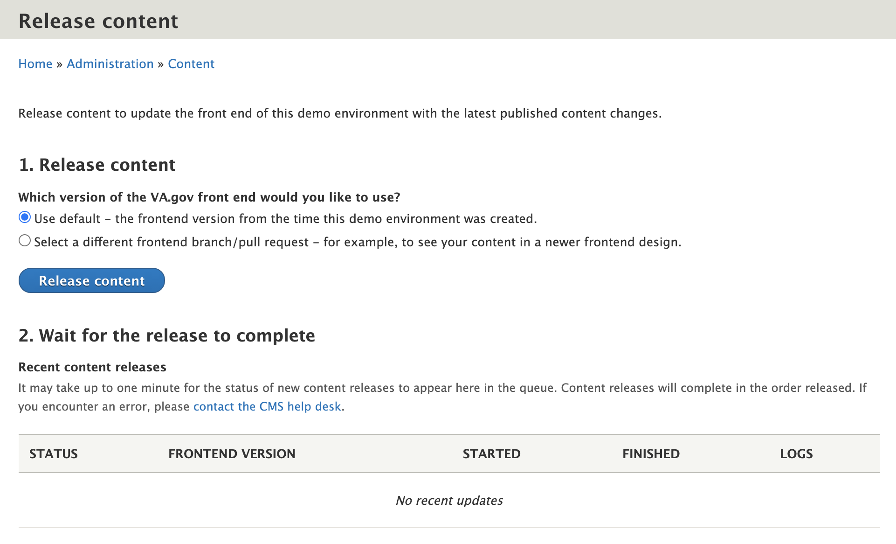

## WEB & CMS Integration

This Drupal site acts solely as a CMS and Content API for the Front-End Website Generator.
The actual website for va.gov is powered by the [vets-website](https://github.com/department-of-veterans-affairs/vets-website) repo.

The `WEB` project is built on Metalsmith. The project consumes the Drupal CMS GraphQL endpoint and generates static files for VA.gov.

### CMS & WEB Unity

In order to fully test and stabilize the **WEB** building process as it consumes **CMS** content, we need to build the
**WEB** project in the **CMS-CI** system, and be able to pin the version we are working with.

There a number of components that allow us to build the **WEB** project inside
the **CMS** build process:

- Add **WEB** as a composer "package", with its version defined in the **CMS** composer.json's "repositories" section.
- Require the [mouf/nodejs-installer](https://packagist.org/packages/mouf/nodejs-installer) package.
  This tool automatically installs executable versions of Node and NPM at the specific version we set in `composer.json`.
- Add to `composer.json`'s "scripts" section (post-install-cmd), to kick off "yarn build" and "npm build" commands after `composer install`.
- Add Composer commands (See `composer.json`'s "scripts" section) to faciitate building and rebuilding the **WEB** project.
- To confirm this entire stack is working, the Behat test suite includes editing a CMS node, running the web rebuild,
  then confirms edited content is visible.

### Developing WEB and CMS Together

#### Change branch or SHA of WEB

CMS developers can change the version of the WEB project they want with standard composer commands:

```bash
# Use a specific SHA
lando composer require va-gov/web:dev-master#7b4c87257cfc9b5e684c4ba7ddca283efbc4329d
# Use a specific branch
lando composer require va-gov/web:dev-branch_name
```

Then followup with a `lando composer update --lock` and `lando composer va:web:build` will build the front-end with the new hash.

#### Rebuild WEB from a local CMS

There is a composer command to rebuild the WEB front-end static files from a locally running Drupal site:

```
composer va:web:build
```

This command will regenerate the HTML and CSS for the entire site, and will put it into `./docroot/static`.

If using lando, you can load it using http://va-gov-cms.lndo.site/static.

NOTE: We are working on a method to load this content from a root url, like http://va-gov-web.lndo.site

#### Rebuild WEB from a CMS-CI Environment

The **CMS-CI** system rebuilds the PR sites, including **WEB** every time code is pushed via git.

If team members wish to rebuild WEB manually, they may log into the CMS preview, go to the "Release Content" page, and press the "Release content" button.



### Build CMS PR Environment for WEB PR

If a WEB developer has an open PR (or just commits) and wants to get a PR environment with the CMS and the WEB code, they
can open a PR in the `va.gov-cms` repository:

1. Fork the va.gov-cms repository.
1. Determine the SHA of the WEB code you want to test.
1. Put that SHA into the "reference" field in `composer.json`, as described above.
1. Visit [Create Pull Request](https://github.com/department-of-veterans-affairs/va.gov-cms/compare?expand=1) page of the CMS repo, and describe your intentions.
1. Wait for the Deployment notification to give you a link to your new site.

- You will see the text "va-cms-bot requested a deployment to Tugboat"
- Your site will have a URL with the pattern: https://pr123-{hash}.ci.cms.va.gov. To see the WEB version of the site, add "web" to the beginning: https://web-{hash}.ci.cms.va.gov

[Table of Contents](../README.md)
