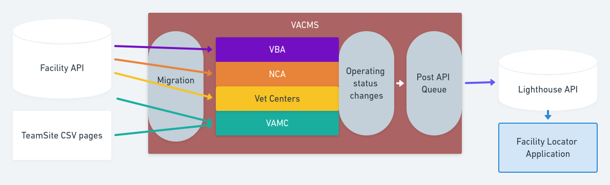

# VAMC Facilities

1. [Facility Migrations](migrations-facilities.md#facility-migrations)
2. [Status Updates to Lighthouse](#status-changes-to-lighthouse)
3. [Facility Service Updates to Lighthouse](#facility-service-changes-to-lighthouse)

## Status Changes to Lighthouse
Whenever any NCA facility, VAMC facility, VBA faciltiy, Vet Center, or Vet
Center Outstation has a change of "Operating status" or "Operating status -
more info" saved in VACMS (whether by an editor, or migration), a change post is
added to the "post API queue" by module:va_gov_post_api. When cron runs, any
items in the queue are posted to the Lighthouse API.

## Facility Service Changes to Lighthouse
To meet the need for getting timely information related to COVID-19 Vaccines out
to the Facility Locator, we are pushing this data to Lighthouse any time a
"COVID-19 Vaccines" facility service is saved under the following criteria:
 - New and published
 - New and draft
 - Draft of unpublished
 - Archived

 Drafts of a published service are intentionally not pushed.  A change post is
added to the "post API queue" by module:va_gov_post_api. When cron runs, any
items in the queue are posted to the Lighthouse API.  Queueing logic is all
handled in [PostFacilityService.php](../docroot/modules/custom/va_gov_post_api/src/Service/PostFacilityService.php).  This service is currently only using Covid-19
Vaccines but is expandable to handle more or eventually all services.

[Table of Contents](../README.md)
