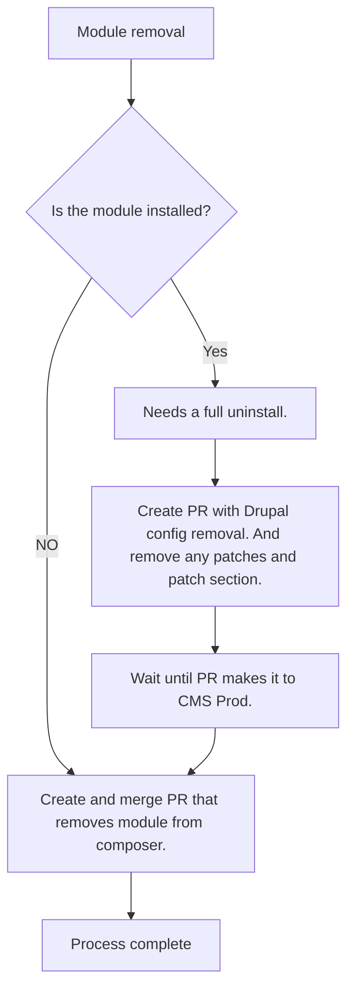

# Workflow
1. [Project](#project)
1. [Git](#git)
    1. Branches
    1. Example Workflow
    1. Pull Request Norms
    1. Merge Conflicts
1. [Drupal SpecTool](#drupal-spectool)
1. [Patching](#patching)
1. [Updates](#updates)
    1. [Updating Drupal/Lightning](#updating-lightning)
    1. [Updating Contrib Modules](#updating-contrib-modules)
1.  [Module Uninstal / Removal](#module-removal--uninstall)

## Project
1. Pull a ticket, move to 'In Development'
1. Review the ticket's story, Acceptance Criteria, and Implementation Notes. Raise any questions/concerns/risks in the ticket comments and mention the relevant/appropriate people.
1. Write a manual to test ticket completion.

## Git
To avoid cluttering up the repo with lots of branches, fork the repo and push your branches to your fork and make your pull request from your fork to the upstream repo. You can use the GitHub CLI, [`gh`](https://cli.github.com/), to make PRs from the command line much faster. Or after you push you will see a link in the output to ctrl + click and create a new PR from the branch you just pushed.  [Getting started](./getting-started.md).

### Branches
We are currently working off a single `main` branch. `main` is protected and requires both approval from code review and passing tests to be merged. Commits within pull requests are squashed and merged when they are accepted so that the only relate to one git commit, even if they originally contained multiple commits, the commit messages are added as a bulleted list so they are retained in the merge commit.

### Example Git workflow:

1. `git fetch --all`
1. `git checkout -b <VACMS-000-name> upstream/main`
1. `ddev composer install`
1. `ddev start` or `ddev restart`
1. `ddev pull va --skip-files`  or `ddev pull va` idf you need managed files (images and pdfs)
1. Running `ddev test` will build the frontend web and run all tests (PHPUnit, Behat, accessibility, FE web) See [testing](testing.md) for additional details.
1. If possible, write your test, before you write code.  The test should fail initially and not pass until you succeed.
1. Fix code formatting issues with CodeSniffer, Drupal standard. (linters should run automatically upon trying to commit.
1. Commit your changes. Each commit should be logically atomic (e.g. module adds in one commit, config in another, custom code in additional logical commits), and your commit messages should follow the pattern: "VACMS-123: A grammatically correct sentence starting with an action verb and ending with punctuation."
_Example: VACMS-1234 Add configuration for menu reduction._
1. Push work to your fork of the repository so a Pull Request may be created
`git push myfork <branchname>`
1. Once your PR is merged it will be automatically deployed to staging.cms.va.gov. If it is merged before 2:30pm ET and tests pass it will be in the daily, scheduled deploy to prod.cms.va.gov at 3:30pm ET.

  While working on your own branch, you may have to rebase it on main which will make it out of sync with your remote branch and will require you to force push to your branch.

### When is it ok to do a force push (-f)?

  On the upstream repo, never.  On your own fork, it is perfectly acceptable to do force pushes.  If you have recently rebased your branch on main, you may have to do a force push to your fork.  When in doubt, ask in Slack.

### Pull Request Norms
* Pull requests should be made against the `main` branch.
* Pull Request title should be in the format: "VACMS-123: ticket title, starting with an action verb and ending with punctuation."
* If your PR is a work in progress or should not be merged, prefix the pull request title with "WIP: " and use the Draft feature.
* Put a link to the ticket at the top of the PR description.
* Add required notes in the PR description:
  1. If the PR requires manual deployment steps (this should rarely happen).
  1. If the timing of the merging of the PR affects or has dependencies on additional PRs in this or other repositories.
  1. If the PR removes existing functionality that may impact other developers.
  1. When the PR is ready for review, add appropriate QA steps and take it out of draft.


### Resolving merge conflicts
Merge conflicts result when multiple developers submit PRs modifying the same code and Git cannot automatically resolve the conflict. For instance, if two developers add update hooks to the same module at the same time, these will necessarily conflict, because update hooks must be numbered in a defined sequence.

Developers are responsible for fixing merge conflicts on their own PRs. Follow this process to resolve a merge conflict:

1. Fetch upstream history: `git fetch upstream`
1. Check out the branch against which you opened your PR (e.g., main): `git checkout main`
1. Make sure it matches upstream: `git reset --hard upstream/main`
1. Check out your feature branch: `git checkout feature/VACMS-123-short-desc-mi`
1. Merge `main` branch: `git rebase main`
1. At this point, Git will complain about a merge conflict. Run `git status` to find the conflicting file(s).
1. Edit the files to fix the conflict. The resources at the end of this section provide more information on this process.
1. Use git add to add all of the files you fixed. (Do not commit them)
1. Finally, run `git rebase --continue` to finish the merge, then `git push origin VACMS-123-short-desc-mi -f` to update the PR.


Additional resources:
* https://confluence.atlassian.com/bitbucket/resolve-merge-conflicts-704414003.html
* https://githowto.com/resolving_conflicts


## Merge conflict with composer.lock
If your composer.lock ends up with a conflict due to incoming changes, these steps should safely resolve the conflict.
  1. Make note of what new packages are coming in from main.
  1. Make note of what package(s) you were adding.
  1. Checkout the incoming changes to composer.
  `git checkout upstream/main -- composer.lock composer.json`
  1. Replay your package addition(s).
  `ddev composer require {new/package} --update-with-dependencies`
  1. Run the new updates to make sure you have them locally.
      1. `ddev composer update {incoming/package}`  - repeat for each incoming package addition
      1. `ddev composer update {your/package}`  - repeat for each package you were adding
  1. Your environment can now be tested with the new code.
  1. Commit the changes to composer.json and composer.lock.


## Drupal SpecTool

* We use the [Drupal SpecTool](https://github.com/acquia/drupal-spec-tool) to keep track of config changes, and generate tests related to roles, content types, fields, menus views.
* If you are modifying configuration of roles, content types, fields, menus views, Go update the appropriate tab(s) in our version of the [SpecTool](https://airtable.com/invite/l?inviteId=invOjKEIyZCQY5YRy&inviteToken=eea85291ef1cd72ce9560c5a833a18673ef10a92050f9210e878702e81ec49b3&utm_source=email).
* Edit the 'Data used in Behat test' view for the appropriate tables
* Once all the modifications are made to the appropriate table(s), click on the "Extensions" link in the top right corner and choose 'Behat Tests' from the dashbaord selector. Click the 'run' button and follow the prompts to generate the test you need, then copy the output to your clipboard.
* Open the related file in [/tests/behat/drupal/drupal-spec-tool/](../tests/behat/drupal/drupal-spec-too/)
* Delete all the existing text in the file and paste in what you copied from the SpecTool.  (Do not format the output in any way. Disable any Behat beautifier plugins.)
* After updating config, run `composer va:test:behat --tags=dst` to run just the spec tool tests. Discrepancies between code and config will be reflected in test output
* If needed, run tests again, correcting and updating the spreadsheet, and exporting accordingly until tests and spreadsheet are in sync.
* Export config to code: `ddev drush config:export` then commit test and config changes and make your Pull Request.   Your newly updated Behat tests will run along with the other tests and passing or failure will be indicated on your PR.   Please make sure they are passing locally before sending the PR for code review.

## Javascript

We follow the [Drupal core javascript workflow](https://www.drupal.org/node/2815083), writing code in `es6.js` files and transpiling to ES5 for backwards compatibility. Both the `es6.js` and transpiled `.js` files are committed to the repository. To follow this workflow:

* Create or edit a `.es6.js` file under `docroot/modules/custom` or `docroot/themes/custom`
* Run `ddev npm install` to ensure that all dependencies are up to date
* From the repository root, execute the command `ddev npm run build:js` (To have changes automatically transpiled while you work, run `ddev npm run watch:js`)
* When you are finished, commit the changes to both files

## Patching
We use the Composer plugin Composer Patches (https://github.com/cweagans/composer-patches) to apply patches that haven't been merged upstream yet. Patches should always be temporarily applied with an upstream issue being opened and/or tracked and the intention for the patch to be removed as soon as it is merged upstream and a new release created and included with Composer.

* Get the patch file:
  * e.g. https://patch-diff.githubusercontent.com/raw/drupal-graphql/graphql/pull/726.patch
  * For GitHub, you can usually type in `.patch` at the end of the PR URL to get the patch file
  * Some people use GitHub, some use drupal.org. Drupal moved to GitLab recently.
  * If the patch is from a PR rather than an actual file, add it to the upstream issue as a file so that we can reference the file rather than a patch that will float with the upstream PR. A floating patch is a security risk.
* In the `patches` section of `composer.json`, make an entry for the package you are patching, if not already there, write an explanation to what the patch does, and then include the URL to the patch, e.g.:
  * ```
    "patches": {
                   "drupal/migration_tools": {
                       "Add changeHtmlContents DomModifier method": "https://www.drupal.org/files/issues/2018-11-26/change_html_contents-3015381-3.patch",
    ```

 ### Patch Contribution

 Whenever possible, we want to contribute patches to support the community at the same time as our own project needs.  For Drupal contributions, here are some [suggestions for setting up module or issue contributions](https://handbook.civicactions.com/en/latest/050-how-we-work/practice-areas/drupal-practice-area/#contributions-to-drupalorg) to make sure your company and the [Department of Veteran Affairs](https://www.drupal.org/department-of-veterans-affairs) get credited correctly.

## Updates
### Updating Drupal Core (dependabot usually does this so you shouldn't need to do this, but if you do...)

1. `ddev composer update drupal/core --with-dependencies --dry-run`
This will show you what is to change, without actually changing anything.
2. `ddev composer update drupal/core --with-dependencies`
3. `ddev composer update --lock`
4. `ddev drush updatedb --yes`
5. `ddev drush cache:rebuild`
6. `ddev test`
7. Review your changes then commit, e.g. `git commit --message "ddev composer update drupal/core --with-dependencies"`

### Updating Contrib Modules
1. `ddev composer update drupal/MODULE_NAME --with-dependencies` # This updates the composer.lock file
2. `ddev drush updatedb --yes`
3. `ddev drush cache:rebuild`
4. `ddev test` to make sure nothing broke.
5. Commit your work, e.g. `git commit --message "ddev composer update drupal/MODULE_NAME --with-dependencies"`

## Module Removal / Uninstall




[Table of Contents](../README.md)
