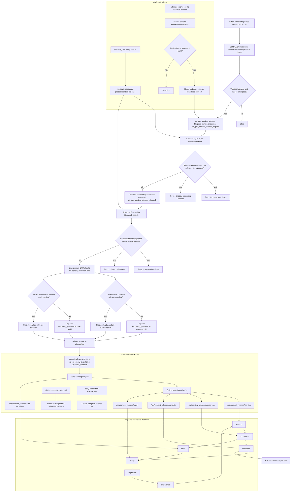
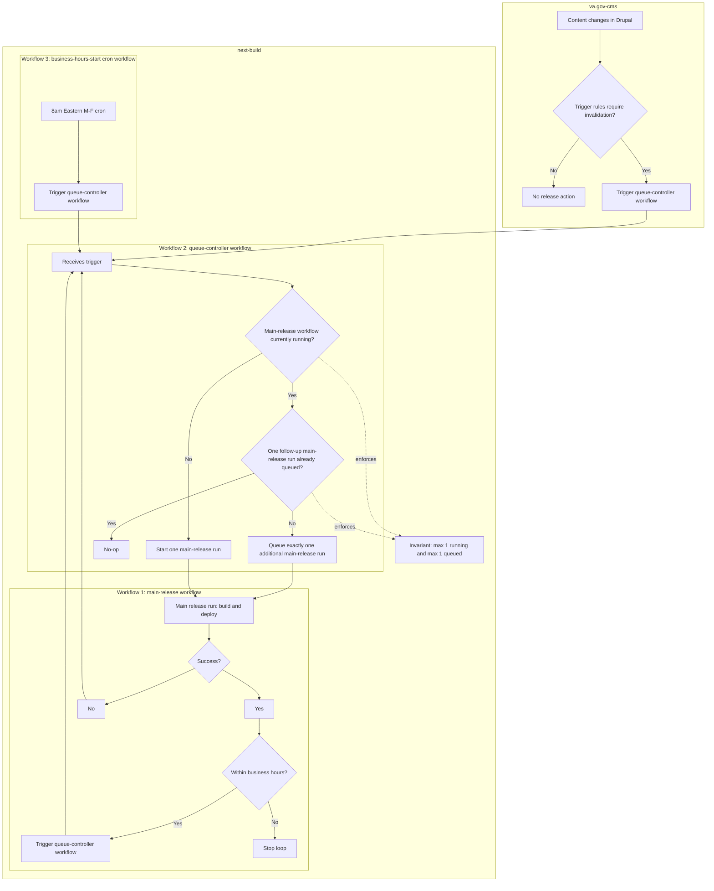

# Content release spike

## Overview

Today, content release behavior is split between Drupal and GitHub Actions. Drupal currently evaluates trigger rules, manages queue/state/scheduling behavior, and dispatches release workflows. GitHub Actions then executes build/deploy logic. This split introduces overlapping orchestration responsibilities and unnecessary complexity.

The proposed change simplifies ownership:
- Drupal continues to own editorial/business trigger rules (deciding *if* a content change should trigger a release).
- GitHub Actions becomes the single orchestration layer (deciding *when/how* releases run, including concurrency, fallback scheduling, retries, and notifications).

In practical terms, this means removing most release lifecycle orchestration from Drupal (state machine, queue-driven orchestration, cron-based fallback checks) and replacing it with a thinner dispatch path. Next-build workflows are then hardened to preserve required operational behavior with clearer, centralized control.

Decision:
- Drupal should remain the source of truth for **content trigger rules** ("should this content change trigger a release?").
- GitHub Actions should own **release orchestration** ("when/how releases run, overlap prevention, retries, fallback cadence, and deploy execution").

Why:
- Current behavior is split across multiple CMS modules and responsibilities (rule evaluation, queueing, scheduling, state machine, dispatch).
- This creates complexity and duplicated orchestration concerns that GitHub Actions can handle more directly.
- Next-build already has workflow-based release patterns and schedule/concurrency primitives that can absorb orchestration responsibilities.

Recommended target model:
- Drupal emits a lightweight release intent/dispatch when trigger rules pass.
- Next-build Actions handles concurrency, deduplication behavior, fallback schedule, retries, alerting, and metrics.
- Use a "latest-wins" release model (acceptable for static site content releases where each release publishes current CMS state).

Key safeguards to preserve:
- No overlapping production releases.
- Scheduled fallback remains in place for resilience.
- Trigger source observability (`drupal`, `schedule`, `manual`).
- Clear rollback switch during migration.

Outcome:
- This spike should close with follow-up implementation work tracked in one epic with scoped child tickets (below).

## Current release flow

### 1) Content change trigger and decision path in Drupal

The release path is spread across Drupal event subscribers, Advanced Queue jobs, a Drupal state machine, multiple GitHub workflows, and separate cron-like safety jobs. Because ownership and control are fragmented, operators have to reason about many handoffs to understand one release, and failures can look like "stuck state" in CMS even when the underlying workflow behavior differs.

## After: proposed simplified architecture

### Summary

- `content-build` is sunset; production content releases run in `next-build` only.
- The system uses three workflows: `main-release`, `queue-controller`, and an `8am ET M-F` cron starter.
- `queue-controller` is the single control point for dispatch decisions and always enforces the invariant: max one running `main-release` plus max one queued follow-up.
- `main-release` runs build/deploy and, when still in business hours at job end, re-triggers `queue-controller` to continue the loop.
- Outside business hours, the loop naturally stops; the next weekday `8am ET` cron re-primes the system by triggering `queue-controller`.
- Drupal invalidation requests trigger `queue-controller` and rely on the same queue invariant logic rather than bespoke branching.

### 1) End-to-end loop

## Notes

- Before state shows why orchestration is complex: decisioning, queueing, state transitions, callbacks, and schedule logic are split across systems.
- After state removes content-build and centralizes all release execution in next-build.
- Three next-build workflows are explicit: main-release, queue-controller, and 8am business-hours-start cron.
- Cron, Drupal invalidations, and in-loop continuation all trigger the same queue-controller workflow.
- The main release loop continues only during business hours and still enforces max 1 running plus max 1 queued.
- In the event of release failure, queue-controller workflow is triggered (will either run or queue 1 additional job)
- Not shown here: Reporting (i.e. Slack) which, likely, should be implemented at the Succes? stage.

## Proposed tickets (high-level)

Implementation should use a **parallel-run migration**: build an entirely new workflow set in `next-build` without replacing current production behavior first. During validation, the new release path runs in **dry-run mode** and does not deploy/release to any environment. Run both paths for parity checks, compare logs/metrics, then cut over behind an explicit switch.

1. **Epic: Next-build release orchestration migration (parallel-run to cut-over)**
   - Track all child tickets, dependencies, rollout gates, and ownership across CMS + next-build.

2. **Create Workflow 1: `main-release` (net-new)**
   - Add a new main release workflow that loops only during business hours by re-triggering the controller at job end.
   - Implement a dry-run execution path for this new workflow during migration so it performs orchestration/validation steps but does not deploy or release anywhere.
   - Keep existing release workflows untouched during initial implementation.

3. **Create Workflow 2: `queue-controller` (net-new)**
   - Add a dedicated workflow that enforces invariant logic: max 1 running + max 1 queued for `main-release`.
   - Ensure it is source-agnostic (Drupal, cron, or in-loop continuation).
   - This workflow will have a lot of runs, so include cleanup. I.e. https://github.com/marketplace/actions/github-maintenance-action

4. **Create Workflow 3: `business-hours-start` (net-new cron starter)**
   - Add new 8am ET M-F scheduler that triggers `queue-controller`.
   - Confirm scheduler behavior does not bypass controller logic.

5. **Drupal integration: route invalidation calls to `queue-controller`**
   - Add new dispatch target in CMS for invalidation events, while preserving current path until cut-over.
   - Add a runtime toggle so teams can switch between old and new dispatch targets safely.

6. **Observability + parity validation for dual-run period**
   - Add structured logging/metrics to correlate trigger source, run id, queue decisions, and outcomes across old/new paths.
   - Build a comparison dashboard/report to verify expected parity and identify drift.

7. **Test plan + staged rollout ticket**
   - Define integration tests and operational test cases (business-hours loop, off-hours stop, max queue invariant, failure handling).
   - Execute in lower envs, then production shadow/dual-run window with explicit entry/exit criteria, confirming dry-run path has zero release side effects.

8. **Cut-over + rollback ticket**
   - Execute planned cut-over from current workflows to the new workflows after logging and testing acceptance criteria are met.
   - As part of cut-over, switch new workflows from dry-run to active deploy/release behavior.
   - Keep one-command rollback path to re-enable legacy flow during stabilization window.

9. **Legacy cleanup ticket (post-stabilization)**
   - Remove deprecated workflow/state orchestration paths only after cut-over is stable for an agreed period.
   - Update runbooks and on-call documentation to reflect final ownership model.
