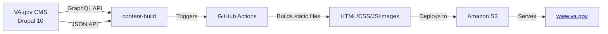

# VaGovBuildTrigger

The VaGovBuildTrigger module is a crucial component in the VA.gov content publishing workflow.

## 1. Purpose

- It's responsible for triggering the build process that publishes content from the Drupal CMS to the public-facing VA.gov website

## 2. Architecture Context

- VA.gov is a static site hosted on S3 with HTML, CSS, JavaScript and images
- The CMS is built on Drupal 10 and acts as both a content management tool and an API server
- Content builds are executed through the content-build project which pulls content via GraphQL and other APIs

## 3. Importance

- It's a key part of the decoupled architecture, bridging the gap between content creation in the CMS and publication to VA.gov
- Enables the continuous integration process where content changes trigger new builds
- Works with GitHub Actions to initiate builds that generate static assets which get deployed to S3

## 4. Integration Points

- Interfaces with the content-build repository
- Works alongside other modules like va_gov_content_release to manage the content deployment pipeline
- Coordinates with both development environments and production systems (prod.cms.va.gov)

The module is essential for maintaining the automated, decoupled publishing workflow that powers VA.gov's content management system.

